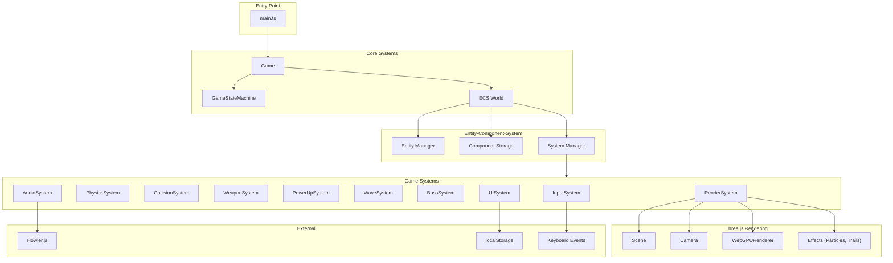
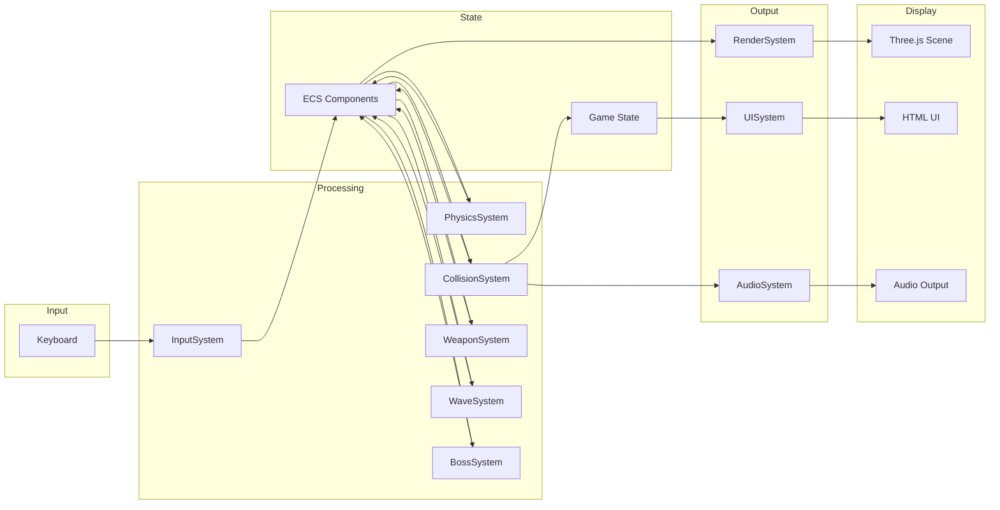
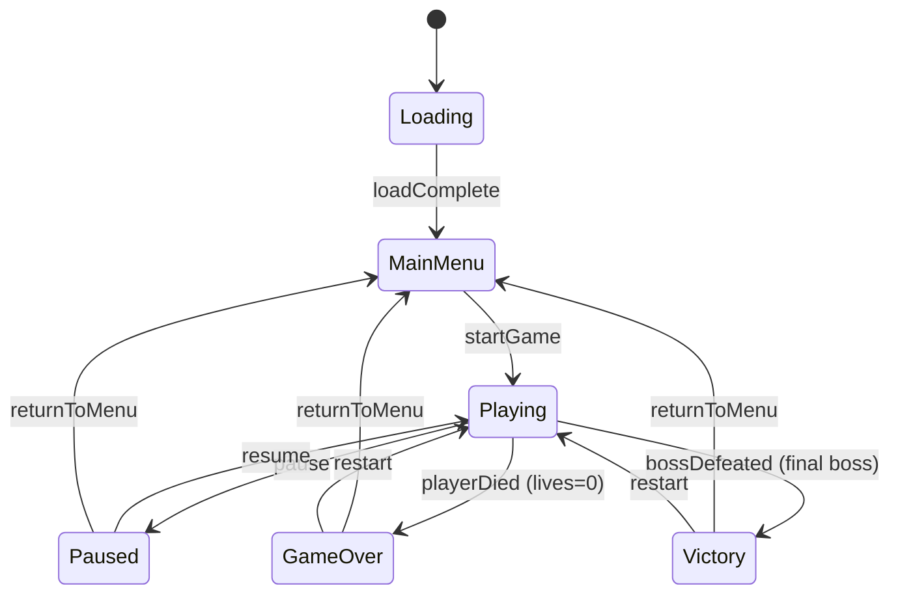

# 3D Asteroids Game Design Document

## Overview

A modern 3D browser-based Asteroids game built with Three.js, TypeScript, and Vite featuring power-ups, weapon systems, boss battles, and progression mechanics. The game reimagines the classic formula with modern 3D graphics while maintaining the core gameplay loop that made the original compelling.

## Design Summary (Meta)

```yaml
design_type: "new_feature"
risk_level: "medium"
main_constraints:
  - "60 FPS performance on mid-range hardware (2020+)"
  - "Browser-only, keyboard controls, single-player"
  - "WebGPU with WebGL 2 fallback required"
  - "No external game frameworks (pure Three.js)"
biggest_risks:
  - "Performance with many simultaneous entities and particles"
  - "Custom physics edge cases and collision detection accuracy"
  - "WebGPU/WebGL visual consistency across browsers"
unknowns:
  - "Optimal entity count before performance degradation"
  - "Best spatial partitioning strategy for collision broad phase"
  - "Whether boss AI complexity requires hierarchical state machines"
```

## Background and Context

### Prerequisite ADRs

- [ADR-0001: Game Architecture Pattern](../adr/ADR-0001-game-architecture-pattern.md): ECS architecture for entity management
- [ADR-0002: Physics Approach](../adr/ADR-0002-physics-approach.md): Custom arcade physics for 2.5D gameplay
- [ADR-0003: Rendering Strategy](../adr/ADR-0003-rendering-strategy.md): Three.js WebGPURenderer with auto-fallback
- [ADR-0004: Audio System](../adr/ADR-0004-audio-system.md): Howler.js for cross-browser audio
- [ADR-0005: State Management](../adr/ADR-0005-state-management.md): FSM for game flow states

### Agreement Checklist

#### Scope
- [x] Core gameplay: ship movement, asteroid spawning, shooting, collision, scoring
- [x] Lives and health system with invulnerability period
- [x] Power-up system: Shield, Rapid Fire, Multi-shot, Extra Life
- [x] Weapon system: Single shot, Spread shot, Laser beam, Homing missiles
- [x] Wave-based progression with difficulty scaling
- [x] Boss enemies every 5 levels with unique patterns
- [x] Visual effects: particles, trails, screen shake
- [x] Audio: SFX, music, volume controls
- [x] UI: Main menu, pause, game over, HUD, leaderboard

#### Non-Scope (Explicitly not changing)
- [x] Mobile/touch controls (desktop keyboard only)
- [x] Online leaderboard (local storage only)
- [x] Multiplayer (single-player only)
- [x] Account system (no backend)
- [x] VR support

#### Constraints
- [x] Parallel operation: Not applicable (greenfield)
- [x] Backward compatibility: Not applicable (greenfield)
- [x] Performance measurement: Required (60 FPS, <100 draw calls, <5s load)

### Problem to Solve

Create an engaging browser-based 3D Asteroids game that provides:
- Immediate accessibility (no download/installation)
- Modern visual appeal while honoring classic gameplay
- Progression and replayability through power-ups, weapons, and bosses
- Smooth performance across modern browsers

### Requirements

#### Functional Requirements

From PRD - Must Have (MVP):
- Player ship control with WASD/Arrow key rotation-based steering
- Asteroid spawning, splitting, and destruction mechanics
- Shooting with spacebar, multiple weapon types
- Collision detection for all entity interactions
- Scoring system with size-based points
- Lives system with respawn invulnerability
- Power-up collection and effects
- Wave-based level progression
- Boss enemies with unique attack patterns
- Visual effects (particles, trails, screen shake)
- Audio system with SFX and music
- Menu system (main, pause, game over)
- Local leaderboard with top 10 scores

#### Non-Functional Requirements

- **Performance**: 60 FPS on mid-range hardware, <100 draw calls, <500MB RAM
- **Load Time**: Initial load under 5 seconds on broadband
- **Compatibility**: Chrome 90+, Firefox 90+, Safari 15+, Edge 90+
- **Reliability**: WebGL 2 fallback, state persistence on pause

#### Technical Requirements

- **Three.js Version**: r171 or later required (WebGPU renderer stabilized in r171)
  - Import path: `import { WebGPURenderer } from 'three/webgpu'`
  - For r170 or earlier, WebGPURenderer requires experimental setup
- **TypeScript**: 5.0+ for Three.js type support

## Acceptance Criteria (AC) - EARS Format

### Core Gameplay

#### Ship Control
- [ ] **When** player presses left/right arrow or A/D keys, the ship shall rotate at 180 degrees per second
  - **Property**: `rotationSpeed === Math.PI` (radians/second)
- [ ] **When** player presses up arrow or W key, the ship shall accelerate in facing direction
  - **Property**: `acceleration > 0 && direction === ship.facing`
- [ ] **While** no thrust input is active, the ship shall decelerate with damping factor
  - **Property**: `velocity.length() < previousVelocity.length()`
- [ ] **When** ship exits screen boundary, the ship shall appear on opposite edge
  - **Property**: `position.x = (position.x + bounds.width) % bounds.width`

#### Asteroid Behavior
- [ ] **When** game wave starts, asteroids shall spawn from screen edges with randomized trajectories
  - **Property**: `spawnPosition.isOnEdge && velocity.isRandom`
- [ ] **When** large asteroid is destroyed, the system shall spawn 2-3 medium asteroids
  - **Property**: `spawnCount >= 2 && spawnCount <= 3 && size === 'medium'`
- [ ] **When** medium asteroid is destroyed, the system shall spawn 2-3 small asteroids
- [ ] **When** small asteroid is destroyed, the system shall not spawn child asteroids
- [ ] The system shall increase asteroid count by 2 per wave starting from 3
  - **Property**: `asteroidCount === 3 + (wave - 1) * 2`
- [ ] The system shall increase asteroid base speed by 5% per wave, capped at 2x
  - **Property**: `speedMultiplier === Math.min(1 + (wave - 1) * 0.05, 2.0)`

#### Shooting Mechanics
- [ ] **When** player presses spacebar with default weapon, the system shall fire single projectile in facing direction
- [ ] **When** projectile exits screen bounds, the projectile shall be destroyed
- [ ] **When** projectile collides with asteroid, both shall process collision (projectile destroyed, asteroid damaged)
- [ ] The system shall enforce weapon-specific fire rate limits
  - **Property**: `timeSinceLastShot >= weapon.cooldown`

#### Collision Detection
- [ ] **When** ship collides with asteroid (no shield), the ship shall lose one life
- [ ] **When** ship collides with power-up, the power-up shall be collected and effect applied
- [ ] **When** projectile collides with boss, the boss shall take damage
- [ ] Collision detection shall complete within frame budget (16ms total frame time)

#### Scoring
- [ ] **When** small asteroid destroyed, score shall increase by 100 points
- [ ] **When** medium asteroid destroyed, score shall increase by 50 points
- [ ] **When** large asteroid destroyed, score shall increase by 25 points
- [ ] **When** boss defeated, score shall increase by 1000+ points (scaling with level)
  - **Property**: `bossScore >= 1000`

### Lives and Health System

- [ ] The player shall start each game with 3 lives
  - **Property**: `initialLives === 3`
- [ ] **When** ship is destroyed, lives shall decrement by 1
- [ ] **If** lives reach 0, **then** game state shall transition to GameOver
- [ ] **When** ship respawns after destruction, the ship shall have 3 seconds invulnerability
  - **Property**: `invulnerabilityDuration === 3000` (ms)
- [ ] **While** ship is invulnerable, the ship shall display visual indicator (flashing)

### Power-up System

- [ ] **When** asteroid is destroyed, there shall be chance to spawn power-up
  - **Property**: `spawnChance <= 0.1` (10% or configurable)
- [ ] **When** Shield power-up collected, ship shall be invulnerable for 10 seconds
  - **Property**: `shieldDuration === 10000` (ms)
- [ ] **When** Rapid Fire power-up collected, fire rate shall double for 15 seconds
  - **Property**: `fireRateMultiplier === 2 && duration === 15000`
- [ ] **When** Multi-shot power-up collected, ship shall fire 3 projectiles for 15 seconds
  - **Property**: `projectileCount === 3 && spreadAngle === 15` (degrees)
- [ ] **When** Extra Life power-up collected, lives shall increment by 1
- [ ] Power-up timers shall be visible in HUD while active

### Weapon System

- [ ] **When** Spread Shot equipped, firing shall produce 3 projectiles at 15-degree spread
- [ ] **While** Laser Beam equipped and spacebar held, continuous beam shall damage entities in line
- [ ] **When** Laser Beam used, energy shall deplete; energy shall regenerate when not firing
- [ ] **When** Homing Missiles equipped, projectiles shall track nearest asteroid
- [ ] Homing Missiles shall have limited ammo counter visible in HUD

### Level Progression

- [ ] **When** all asteroids in wave destroyed, next wave shall start after 3-second delay
  - **Property**: `waveTransitionDelay === 3000` (ms)
- [ ] **When** wave 5, 10, 15... (every 5th) reached, boss shall spawn instead of asteroids
- [ ] Boss health shall scale with level
  - **Property**: `bossHealth === baseHealth * (1 + level * 0.1)`

### Weapon and Power-up Interactions

- [ ] Multi-shot power-up applies to current weapon, creating 3-projectile spread pattern
- [ ] **When** Multi-shot active with Spread Shot weapon, ship fires 3 projectiles (not 9)
  - **Property**: `projectileCount === 3` (power-up modifies spread, not multiplies quantity)
- [ ] **When** Multi-shot active with Laser weapon, beam splits into 3 beams at 15-degree spread
- [ ] **When** Rapid Fire active with any weapon, cooldown reduced by 50%
  - **Property**: `effectiveCooldown === weapon.cooldown * 0.5`

### Boss Enemies

- [ ] **When** boss wave triggered, warning announcement shall display
- [ ] Boss shall have visible health bar during combat
- [ ] **When** boss defeated, guaranteed power-up and weapon unlock potential shall drop
- [ ] Each boss type shall have minimum 2 distinct attack patterns

### Visual Effects

- [ ] **When** entity destroyed, particle explosion shall play for 0.5-2 seconds (size-dependent)
  - **Property**: `particleDuration >= 500 && particleDuration <= 2000` (ms)
- [ ] **While** ship thrusting, flame particles shall emit from rear
- [ ] Projectile trails shall fade over distance with weapon-appropriate color
- [ ] **When** ship takes damage or boss hit, screen shall shake proportionally

### Audio

- [ ] Each game action shall have distinct sound effect (shoot, explode, collect, thrust)
- [ ] Background music shall loop seamlessly during gameplay
- [ ] Volume settings shall persist in localStorage between sessions
- [ ] **When** user interacts first time, audio context shall resume (autoplay policy)

### UI/Menus

- [ ] Main menu shall display: Play, Settings, Leaderboard options
- [ ] **When** ESC pressed during gameplay, game shall pause and show pause menu
- [ ] **While** paused, game simulation shall freeze completely
- [ ] HUD shall display: Score, Lives, Current Weapon, Current Wave, Active Power-ups
- [ ] Game Over screen shall show final score and option to enter name for leaderboard
- [ ] Leaderboard shall display top 10 scores sorted descending

### Performance

- [ ] Frame rate shall maintain 60 FPS on target hardware 95% of gameplay time
- [ ] Draw calls shall remain under 100 per frame
- [ ] Initial load shall complete in under 5 seconds on broadband

## Existing Codebase Analysis

### Implementation Path Mapping

| Type | Path | Description |
|------|------|-------------|
| New | src/main.ts | Application entry point, renderer initialization |
| New | src/game/Game.ts | Main game class orchestrating systems |
| New | src/ecs/ | Entity-Component-System core implementation |
| New | src/systems/ | ECS systems (physics, collision, render, input, audio) |
| New | src/components/ | Component definitions (Transform, Velocity, Renderable, etc.) |
| New | src/entities/ | Entity factory functions (createShip, createAsteroid, etc.) |
| New | src/state/ | Game state machine and state definitions |
| New | src/ui/ | UI components (HUD, menus) |
| New | src/audio/ | Audio manager wrapping Howler.js |
| New | src/utils/ | Utility functions (math, random, spatial partitioning) |
| New | src/types/ | TypeScript type definitions |
| New | src/config/ | Game configuration constants |
| New | public/assets/ | Audio files, textures (if any) |

### Integration Points

This is a greenfield project with no existing codebase. Integration points are defined between new modules:

- **Vite Entry Point**: `index.html` loads `src/main.ts`
- **Three.js Integration**: Render system syncs ECS Transform components to Three.js Object3D
- **Howler.js Integration**: Audio manager wraps Howler for game-specific API
- **Browser APIs**: localStorage for leaderboard/settings, keyboard events for input

## Design

### Change Impact Map

```yaml
Change Target: New 3D Asteroids Game (Greenfield)
Direct Impact:
  - All new source files in src/
  - New configuration in vite.config.ts, tsconfig.json, package.json
Indirect Impact:
  - None (greenfield project)
No Ripple Effect:
  - N/A (no existing systems)
```

### Architecture Overview

The game follows an Entity-Component-System (ECS) architecture with clear separation between:
- **Entities**: Identifiers (numbers/symbols) for game objects
- **Components**: Pure data attached to entities (Transform, Velocity, Health, etc.)
- **Systems**: Logic operating on entities with specific component combinations

A Finite State Machine manages game flow (Loading, MainMenu, Playing, Paused, GameOver, Victory).

Three.js handles all 3D rendering, with the RenderSystem syncing ECS state to scene graph.



### Data Flow



### Integration Points List

| Integration Point | Location | Old Implementation | New Implementation | Switching Method |
|-------------------|----------|-------------------|-------------------|------------------|
| Renderer Init | main.ts | N/A | WebGPURenderer async init | Direct |
| Game Loop | Game.ts | N/A | requestAnimationFrame with fixed timestep | Direct |
| Input Binding | InputSystem | N/A | Keyboard event listeners | Direct |
| Audio Playback | AudioManager | N/A | Howler.js wrapper | Factory |
| State Persistence | UISystem | N/A | localStorage API | Direct |
| Scene Sync | RenderSystem | N/A | Transform -> Object3D sync | ECS Query |

### Main Components

#### Game (Orchestrator)

- **Responsibility**: Initialize and coordinate all game systems, manage game loop
- **Interface**: `start()`, `stop()`, `pause()`, `resume()`
- **Dependencies**: ECS World, GameStateMachine, All Systems

#### ECS World

- **Responsibility**: Manage entities, components, and systems
- **Interface**: `createEntity()`, `destroyEntity()`, `addComponent()`, `removeComponent()`, `query()`, `addSystem()`, `update(deltaTime)`
- **Dependencies**: None (core infrastructure)

#### GameStateMachine

- **Responsibility**: Manage game flow states and transitions
- **Interface**: `getCurrentState()`, `transition(event)`, `onEnter()`, `onUpdate()`, `onExit()`
- **Dependencies**: Game (for state-specific updates)

#### InputSystem

- **Responsibility**: Capture keyboard input, translate to game actions
- **Interface**: `isKeyDown(key)`, `isKeyPressed(key)`, `getMovementInput()`, `getActions()`
- **Dependencies**: Browser keyboard events

#### PhysicsSystem

- **Responsibility**: Update entity positions based on velocity, apply damping, handle screen wrapping
- **Interface**: ECS system `update(deltaTime, entities)`
- **Dependencies**: Transform, Velocity, Physics components

#### CollisionSystem

- **Responsibility**: Detect and resolve collisions between entities
- **Interface**: ECS system `update(deltaTime, entities)`
- **Dependencies**: Transform, Collider components; emits collision events

#### WeaponSystem

- **Responsibility**: Handle weapon firing, projectile creation, weapon switching
- **Interface**: ECS system `update(deltaTime, entities)`
- **Dependencies**: Weapon, Transform, Velocity components

#### PowerUpSystem

- **Responsibility**: Apply power-up effects, manage timers, remove expired effects
- **Interface**: ECS system `update(deltaTime, entities)`
- **Dependencies**: PowerUp, PowerUpEffect components

#### WaveSystem

- **Responsibility**: Spawn asteroids, track wave progress, trigger boss waves
- **Interface**: ECS system `update(deltaTime, entities)`
- **Dependencies**: Game state, entity factories

#### BossSystem

- **Responsibility**: Control boss behavior, AI patterns, phase transitions
- **Interface**: ECS system `update(deltaTime, entities)`
- **Dependencies**: Boss, Health, AI components

#### RenderSystem

- **Responsibility**: Sync ECS state to Three.js scene, manage visual effects
- **Interface**: ECS system `update(deltaTime, entities)`, manages Three.js scene
- **Dependencies**: Transform, Renderable components; Three.js scene/renderer

#### AudioManager

- **Responsibility**: Play sounds, manage music, handle volume settings
- **Interface**: `playSound(id)`, `playMusic(id)`, `setVolume(type, level)`, `init()`
- **Dependencies**: Howler.js

#### UISystem

- **Responsibility**: Update HUD, render menus, handle leaderboard
- **Interface**: `updateHUD(gameState)`, `showMenu(menuType)`, `hideMenu()`
- **Dependencies**: DOM elements, localStorage

### Type Definitions

```typescript
// ============================================
// Core ECS Types
// ============================================

/** Unique identifier for an entity */
type EntityId = number

/** Component type identifier */
type ComponentType = string

/** Base component interface - all components are data-only */
interface Component {
  readonly type: ComponentType
}

/** System interface - logic operates on component sets */
interface System {
  readonly requiredComponents: ComponentType[]
  update(deltaTime: number, entities: EntityId[], world: World): void
}

/** ECS World interface */
interface World {
  createEntity(): EntityId
  destroyEntity(id: EntityId): void
  addComponent<T extends Component>(entity: EntityId, component: T): void
  removeComponent(entity: EntityId, type: ComponentType): void
  getComponent<T extends Component>(entity: EntityId, type: ComponentType): T | undefined
  hasComponent(entity: EntityId, type: ComponentType): boolean
  query(...types: ComponentType[]): EntityId[]
  addSystem(system: System): void
  update(deltaTime: number): void
}

// ============================================
// Game Components
// ============================================

interface TransformComponent extends Component {
  type: 'transform'
  position: Vector3  // Three.js Vector3
  rotation: Vector3  // Three.js Vector3 (Euler angles in radians)
  scale: Vector3     // Three.js Vector3
}

interface VelocityComponent extends Component {
  type: 'velocity'
  linear: Vector3
  angular: Vector3
}

interface PhysicsComponent extends Component {
  type: 'physics'
  mass: number
  damping: number
  maxSpeed: number
  wrapScreen: boolean
}

interface ColliderComponent extends Component {
  type: 'collider'
  shape: 'sphere' | 'box'
  radius?: number
  size?: Vector3
  layer: CollisionLayer
  mask: CollisionLayer[]
}

type CollisionLayer =
  | 'player'
  | 'asteroid'
  | 'projectile'
  | 'powerup'
  | 'boss'
  | 'bossProjectile'

interface HealthComponent extends Component {
  type: 'health'
  current: number
  max: number
  invulnerable: boolean
  invulnerabilityTimer: number
}

interface RenderableComponent extends Component {
  type: 'renderable'
  meshType: MeshType
  material: MaterialType
  visible: boolean
  objectId?: string // Three.js Object3D uuid for sync
}

type MeshType =
  | 'ship'
  | 'asteroid_large'
  | 'asteroid_medium'
  | 'asteroid_small'
  | 'projectile_default'
  | 'projectile_spread'
  | 'projectile_laser'
  | 'projectile_missile'
  | 'powerup_shield'
  | 'powerup_rapidfire'
  | 'powerup_multishot'
  | 'powerup_extralife'
  | 'boss_destroyer'
  | 'boss_carrier'

type MaterialType = 'standard' | 'emissive' | 'transparent'

interface WeaponComponent extends Component {
  type: 'weapon'
  currentWeapon: WeaponType
  cooldown: number
  lastFiredAt: number
  ammo: number | 'infinite'
  energy: number
  maxEnergy: number
  energyRegenRate: number
}

type WeaponType = 'single' | 'spread' | 'laser' | 'homing'

interface WeaponConfig {
  type: WeaponType
  cooldown: number
  projectileSpeed: number
  damage: number
  ammo: number | 'infinite'
  energyCost?: number
}

interface PowerUpEffectComponent extends Component {
  type: 'powerUpEffect'
  effects: ActivePowerUp[]
}

interface ActivePowerUp {
  powerUpType: PowerUpType
  remainingTime: number
  totalDuration: number
}

type PowerUpType = 'shield' | 'rapidFire' | 'multiShot' | 'extraLife'

interface AsteroidComponent extends Component {
  type: 'asteroid'
  size: AsteroidSize
  points: number
}

type AsteroidSize = 'large' | 'medium' | 'small'

interface BossComponent extends Component {
  type: 'boss'
  bossType: BossType
  phase: number
  phaseTimer: number
  attackPattern: AttackPattern
}

type BossType = 'destroyer' | 'carrier'

type AttackPattern = 'idle' | 'charge' | 'spray' | 'summon' | 'retreat'

interface ProjectileComponent extends Component {
  type: 'projectile'
  damage: number
  owner: EntityId
  lifetime: number
  homingTarget?: EntityId
}

interface PlayerComponent extends Component {
  type: 'player'
  lives: number
  score: number
}

interface ParticleEmitterComponent extends Component {
  type: 'particleEmitter'
  emitterType: ParticleEmitterType
  active: boolean
  rate: number
  lifetime: number
}

type ParticleEmitterType = 'thrust' | 'explosion' | 'trail' | 'shield'

// ============================================
// Game State Types
// ============================================

type GameFlowState =
  | 'loading'
  | 'mainMenu'
  | 'playing'
  | 'paused'
  | 'gameOver'
  | 'victory'

type GameFlowEvent =
  | 'loadComplete'
  | 'startGame'
  | 'pause'
  | 'resume'
  | 'playerDied'
  | 'bossDefeated'
  | 'returnToMenu'
  | 'restart'

interface GameStateData {
  currentWave: number
  score: number
  lives: number
  currentWeapon: WeaponType
  activePowerUps: ActivePowerUp[]
  bossActive: boolean
}

interface GameSettings {
  sfxVolume: number // 0-1
  musicVolume: number // 0-1
}

interface LeaderboardEntry {
  name: string
  score: number
  wave: number
  date: string
}

// ============================================
// Event Types
// ============================================

interface GameEvent {
  type: GameEventType
  data?: unknown
}

type GameEventType =
  | 'entityDestroyed'
  | 'collision'
  | 'powerUpCollected'
  | 'weaponFired'
  | 'waveComplete'
  | 'bossSpawned'
  | 'bossPhaseChanged'
  | 'scoreChanged'
  | 'livesChanged'

interface CollisionEvent extends GameEvent {
  type: 'collision'
  data: {
    entityA: EntityId
    entityB: EntityId
    layerA: CollisionLayer
    layerB: CollisionLayer
  }
}

// ============================================
// Configuration Types
// ============================================

interface GameConfig {
  physics: PhysicsConfig
  gameplay: GameplayConfig
  audio: AudioConfig
  visual: VisualConfig
}

interface PhysicsConfig {
  shipAcceleration: number
  shipMaxSpeed: number
  shipRotationSpeed: number
  shipDamping: number
  asteroidSpeedBase: number
  asteroidSpeedVariance: number
  projectileSpeed: number
  screenBounds: { width: number; height: number }
}

interface GameplayConfig {
  initialLives: number
  invulnerabilityDuration: number
  waveTransitionDelay: number
  initialAsteroidCount: number
  asteroidsPerWave: number
  maxAsteroidSpeedMultiplier: number
  asteroidSpeedIncreasePerWave: number
  powerUpSpawnChance: number
  bossWaveInterval: number
  scoring: {
    small: number
    medium: number
    large: number
    bossBase: number
  }
  powerUpDurations: {
    shield: number
    rapidFire: number
    multiShot: number
  }
}

interface AudioConfig {
  defaultSfxVolume: number
  defaultMusicVolume: number
  sounds: Record<string, string> // id -> file path
}

interface VisualConfig {
  particleCount: {
    explosion: number
    thrust: number
    trail: number
  }
  screenShake: {
    intensity: number
    duration: number
  }
}

// ============================================
// Utility Types
// ============================================

// Note: Game code uses Three.js Vector3 and Vector2 directly for runtime.
// These type aliases clarify intent and enable IDE support.
// Import from 'three' in actual implementation:
//   import { Vector3, Vector2 } from 'three'
import type { Vector3, Vector2 } from 'three'

// For plain data storage (serialization, config), use simple interfaces:
interface Vector3Data {
  x: number
  y: number
  z: number
}

interface Vector2Data {
  x: number
  y: number
}

interface Result<T, E = Error> {
  ok: true
  value: T
} | {
  ok: false
  error: E
}
```

### Data Contract

#### InputSystem

```yaml
Input:
  Type: KeyboardEvent (browser native)
  Preconditions: Event listener registered on document
  Validation: Key code validation against supported keys

Output:
  Type: InputState { movement: Vector2 (Three.js), actions: Set<Action> }
  Guarantees: Always returns valid InputState, never null
  On Error: Returns neutral InputState (no movement, no actions)
  Note: Vector2 is imported from 'three' package

Invariants:
  - Input state reflects current frame's keyboard state
  - Key states update synchronously with events
```

#### CollisionSystem

```yaml
Input:
  Type: EntityId[] with Collider + Transform components
  Preconditions: Entities have valid Transform and Collider components
  Validation: Entity existence verified via World.hasComponent()

Output:
  Type: CollisionEvent[]
  Guarantees: Each collision reported exactly once per frame
  On Error: Returns empty array, logs warning

Invariants:
  - Collision pairs are deduplicated (A-B same as B-A)
  - Only entities with matching collision masks collide
```

#### AudioManager

```yaml
Input:
  Type: soundId: string, options?: { volume?: number, loop?: boolean }
  Preconditions: Audio context initialized, sound loaded
  Validation: soundId must exist in loaded sounds map

Output:
  Type: void (fire-and-forget for SFX), Howl instance for music
  Guarantees: No throw on missing sound (logs warning instead)
  On Error: Logs warning, returns silently

Invariants:
  - Volume settings persist to localStorage
  - Audio context resumes on user interaction
```

### State Transitions and Invariants



**State Definitions:**

| State | Entry Action | Update Action | Exit Action |
|-------|--------------|---------------|-------------|
| Loading | Start asset loading | Check load progress | Initialize game systems |
| MainMenu | Show main menu UI | Handle menu input | Hide menu UI |
| Playing | Resume game loop | Run all game systems | Freeze game state |
| Paused | Show pause menu, freeze loop | Handle pause menu input | Hide pause menu |
| GameOver | Show game over screen, check leaderboard | Handle restart/menu input | Clean up game state |
| Victory | Show victory screen, award bonuses | Handle restart/menu input | Clean up game state |

**Invariants:**
- Only one state active at any time
- State transitions only via defined events
- Game loop only runs in `Playing` state
- ECS world persists across Pause/Resume
- Score and lives only modified in `Playing` state

**Victory Condition Note:**
Game progression is infinite with wave-based difficulty scaling. The Victory state is reserved for future "campaign mode" where defeating a final boss (e.g., wave 20+) would trigger victory. For MVP, the Victory state can be excluded from implementation; the game ends only via GameOver (lives=0).

### Error Handling

| Error Type | Handling Strategy |
|------------|-------------------|
| Asset Load Failure | Retry 3 times, show error message, allow game start without failed asset |
| WebGPU Init Failure | Automatic WebGL 2 fallback (handled by Three.js) |
| Audio Context Blocked | Defer audio init to first user interaction |
| localStorage Unavailable | In-memory fallback, warn user settings won't persist |
| Entity Creation Failure | Log error, return null entity ID |
| Invalid State Transition | Log warning, ignore invalid transition |

### Logging and Monitoring

```typescript
// Log levels: debug, info, warn, error
// Production: info and above only

// Performance monitoring
interface PerformanceMetrics {
  fps: number
  drawCalls: number
  entityCount: number
  frameTime: number
  physicsTime: number
  renderTime: number
}

// Log format
interface LogEntry {
  timestamp: number
  level: 'debug' | 'info' | 'warn' | 'error'
  system: string
  message: string
  data?: Record<string, unknown>
}

// Debug mode displays: FPS, draw calls, entity count, current state
```

## Implementation Plan

### Implementation Approach

**Selected Approach**: Vertical Slice (Feature-driven)

**Selection Reason**:
- Each feature (ship control, asteroids, weapons, etc.) delivers user-playable value
- Low inter-feature dependencies after core ECS foundation
- Enables early playtesting and iteration on game feel
- Natural fit for game development where "playable at each step" is valuable

Per implementation-approach skill Phase 1-4 analysis:
- **Current State**: Greenfield project with no existing code
- **Strategy**: Start with minimal playable game (ship + asteroids + collision), then layer features
- **Risks**: Custom physics edge cases, performance at scale
- **Constraints**: Browser-only, keyboard controls, 60 FPS requirement

### Technical Dependencies and Implementation Order

#### Phase 1: Foundation (L3 Build Verification)

1. **Project Setup**
   - Technical Reason: All code depends on build tooling
   - Dependent Elements: All subsequent phases
   - Tasks: Vite config, TypeScript config, package.json, directory structure

2. **Core ECS Implementation**
   - Technical Reason: All game entities use ECS
   - Dependent Elements: All systems and entity factories
   - Tasks: World, Entity Manager, Component Storage, System Manager

3. **Type Definitions**
   - Technical Reason: TypeScript requires types before implementation
   - Dependent Elements: All typed code
   - Tasks: All interfaces and types from Type Definitions section

#### Phase 2: Minimal Playable Game (L1 Functional Verification)

4. **Three.js Renderer Setup**
   - Technical Reason: Visual output required for all subsequent testing
   - Dependent Elements: RenderSystem, visual feedback
   - Prerequisites: Project Setup
   - Tasks: WebGPURenderer init, scene, camera, basic lighting

5. **Game Loop**
   - Technical Reason: Systems require update cycle
   - Dependent Elements: All systems
   - Prerequisites: Core ECS
   - Tasks: Fixed timestep physics, variable render, requestAnimationFrame

6. **InputSystem**
   - Technical Reason: Player interaction required for ship control
   - Dependent Elements: Ship control
   - Prerequisites: Game Loop
   - Tasks: Keyboard listeners, input state tracking

7. **Ship Entity + PhysicsSystem**
   - Technical Reason: Core player interaction
   - Dependent Elements: All gameplay
   - Prerequisites: ECS, InputSystem, Renderer
   - Tasks: Ship factory, Transform, Velocity, Physics components, movement

8. **RenderSystem + Object Pooling**
   - Technical Reason: Sync ECS to Three.js with efficient memory management
   - Dependent Elements: Visual display of all entities
   - Prerequisites: Renderer, Ship Entity
   - Tasks: Transform sync, mesh creation, object pooling setup
   - **Object Pooling Strategy**:
     - Projectiles: 50 initial, auto-expand to 200 max
     - Particles: 500 initial pool (explosions generate 20-50 particles each)
     - Asteroids: 30 initial (covers early waves)
     - PowerUps: 10 initial
   - **Performance Baseline**: Verify 60 FPS with 100 entities before Phase 3

9. **Asteroid Entity + Spawning**
   - Technical Reason: Core gameplay element
   - Dependent Elements: Collision, scoring
   - Prerequisites: ECS, RenderSystem
   - Tasks: Asteroid factory, size variants, spawning logic

10. **CollisionSystem**
    - Technical Reason: Core gameplay interaction
    - Dependent Elements: Damage, scoring, power-up collection
    - Prerequisites: Ship, Asteroids
    - Tasks: Broad phase (spatial grid), narrow phase (circle-circle), collision events

**Integration Point 1: Minimal Playable Game**
- Components: Ship + Asteroids + Collision
- Verification: Ship can move, asteroids spawn and move, collisions detected visually

#### Phase 3: Core Gameplay Loop (L1 Functional Verification)

11. **Projectile Entity + WeaponSystem (Default)**
    - Technical Reason: Core shooting mechanic
    - Dependent Elements: Asteroid destruction, weapon variants
    - Prerequisites: Collision, Ship
    - Tasks: Projectile factory, firing logic, collision with asteroids

12. **Asteroid Destruction + Splitting**
    - Technical Reason: Core gameplay progression
    - Dependent Elements: Scoring, wave completion
    - Prerequisites: Projectiles, Collision
    - Tasks: Split logic, particle spawning hooks

13. **Scoring System**
    - Technical Reason: Player feedback and progression
    - Dependent Elements: HUD, Leaderboard
    - Prerequisites: Asteroid destruction
    - Tasks: Score tracking, event emission

14. **Lives System**
    - Technical Reason: Game over condition
    - Dependent Elements: Game state transitions
    - Prerequisites: Collision (ship-asteroid)
    - Tasks: Lives tracking, invulnerability, respawn

15. **Basic HUD**
    - Technical Reason: Player information display
    - Dependent Elements: None
    - Prerequisites: Score, Lives
    - Tasks: HTML overlay, score display, lives display

**Integration Point 2: Core Gameplay Loop**
- Components: Shooting + Destruction + Scoring + Lives
- Verification: Complete gameplay loop (shoot asteroids, score points, lose lives)

#### Phase 4: Game Flow (L1 Functional Verification)

16. **GameStateMachine**
    - Technical Reason: Manages game flow
    - Dependent Elements: Menus, pause, game over
    - Prerequisites: Core gameplay
    - Tasks: FSM implementation, state definitions, transitions

17. **WaveSystem**
    - Technical Reason: Level progression
    - Dependent Elements: Difficulty scaling, boss spawning
    - Prerequisites: Asteroid spawning, FSM
    - Tasks: Wave tracking, asteroid count scaling, speed scaling

18. **Menu System (Main, Pause, Game Over)**
    - Technical Reason: Complete user flow
    - Dependent Elements: None
    - Prerequisites: FSM, HUD
    - Tasks: Menu UI, state transitions, input handling

19. **Leaderboard**
    - Technical Reason: Persistence and replayability
    - Dependent Elements: None
    - Prerequisites: Scoring, Game Over screen
    - Tasks: localStorage, top 10 sorting, name entry

**Integration Point 3: Complete Game Flow**
- Components: FSM + Waves + Menus + Leaderboard
- Verification: Full game session from menu to game over to leaderboard

#### Phase 5: Enhanced Features (L1 Functional Verification)

20. **AudioManager + Basic Sounds**
    - Technical Reason: Feedback and immersion
    - Dependent Elements: All audio playback
    - Prerequisites: Howler.js integration
    - Tasks: Sound loading, playback, volume controls
    - **Audio Loading Strategy**:
      - **Critical (preload before game start)**: shoot, collision, powerup pickup
      - **Lazy-load (after menu displays)**: music, ambient, boss themes
      - **Autoplay Policy**: Defer AudioContext init to first user click/keypress

21. **Power-up System**
    - Technical Reason: Variety and strategy
    - Dependent Elements: Weapon enhancements
    - Prerequisites: Collision, Score
    - Tasks: PowerUp entities, collection, effect timers, HUD display

22. **Weapon Variants (Spread, Laser, Homing)**
    - Technical Reason: Gameplay depth
    - Dependent Elements: Boss combat
    - Prerequisites: WeaponSystem, PowerUps
    - Tasks: Weapon configs, firing patterns, ammo/energy

**Integration Point 4: Enhanced Gameplay**
- Components: Audio + Power-ups + Weapons
- Verification: Power-ups affect gameplay, weapon switching works

#### Phase 6: Boss System (L1 Functional Verification)

23. **Boss Entity + BossSystem**
    - Technical Reason: Progression milestones
    - Dependent Elements: Victory condition
    - Prerequisites: Wave system, weapons
    - Tasks: Boss factory, health bar, AI patterns

24. **Boss AI Patterns**
    - Technical Reason: Engaging boss fights
    - Dependent Elements: None
    - Prerequisites: Boss entity
    - Tasks: Movement patterns, attack patterns, phase transitions

**Integration Point 5: Boss Battles**
- Components: Boss spawning + AI + Combat
- Verification: Boss appears on wave 5, has attack patterns, can be defeated

#### Phase 7: Visual Polish (L2 Test Verification)

25. **Particle System (Explosions, Thrust, Trails)**
    - Technical Reason: Visual feedback
    - Dependent Elements: None
    - Prerequisites: RenderSystem
    - Tasks: Particle emitters, effect configs, pooling

26. **Screen Shake + Camera Effects**
    - Technical Reason: Impact feedback
    - Dependent Elements: None
    - Prerequisites: Collision events
    - Tasks: Camera shake on collision, intensity scaling

27. **Visual Polish Pass**
    - Technical Reason: Quality and appeal
    - Dependent Elements: None
    - Prerequisites: All visuals
    - Tasks: Materials, lighting, color scheme, animations

**Integration Point 6: Visual Complete**
- Components: All visual effects
- Verification: Game looks polished with particles and effects

#### Phase 8: Quality Assurance

28. **Performance Optimization**
    - Tasks: Profiling, draw call reduction, memory optimization, entity pooling

29. **Cross-browser Testing**
    - Tasks: Test Chrome, Firefox, Safari, Edge; verify WebGL fallback

30. **Final Testing + Bug Fixes**
    - Tasks: Full playthrough testing, edge case verification, bug fixes

### Integration Points

**Integration Point 1: Minimal Playable Game**
- Components: Ship + Asteroids + Collision + Rendering
- Verification: Visual confirmation of movement and collision

**Integration Point 2: Core Gameplay Loop**
- Components: Weapons + Destruction + Scoring + Lives + HUD
- Verification: Complete gameplay loop playable

**Integration Point 3: Complete Game Flow**
- Components: FSM + Waves + Menus + Leaderboard
- Verification: Full session start-to-end works

**Integration Point 4: Enhanced Gameplay**
- Components: Audio + Power-ups + Weapon variants
- Verification: All power-ups and weapons function correctly

**Integration Point 5: Boss Battles**
- Components: Boss spawning + AI + Combat
- Verification: Boss fight playable and winnable

**Integration Point 6: Visual Complete**
- Components: Particles + Effects + Polish
- Verification: Game meets visual quality bar

### Migration Strategy

Not applicable - greenfield project with no existing code to migrate.

## Test Strategy

### Unit Tests

**Policy**: All pure functions and isolated components have unit tests.
**Coverage Goal**: 80% code coverage

**Focus Areas**:
- ECS World operations (create, destroy, query)
- Component data validation
- Physics calculations (velocity, collision math)
- State machine transitions
- Scoring calculations
- Power-up effect logic

### Integration Tests

**Policy**: System interactions tested with mock components.

**Focus Areas**:
- CollisionSystem detects valid collisions
- WeaponSystem creates projectiles correctly
- PowerUpSystem applies effects to correct components
- WaveSystem spawns correct asteroid counts

### E2E Tests

**Policy**: Critical user flows tested end-to-end.

**Test Cases**:
1. Game start from menu to gameplay
2. Complete wave and advance to next
3. Collect power-up and verify effect
4. Die and respawn with invulnerability
5. Reach game over and submit score to leaderboard
6. Pause and resume game
7. Boss fight complete flow

### Performance Tests

**Policy**: Performance verified on target hardware.

**Metrics**:
- FPS during 50+ entity scenarios
- Draw calls under 100
- Memory usage under 500MB
- Load time under 5s

## Security Considerations

| Concern | Mitigation |
|---------|------------|
| XSS via Leaderboard Names | Sanitize name input, escape HTML characters |
| localStorage Tampering | Scores are client-side only, no competitive integrity guarantee |
| Audio Autoplay Abuse | Follow browser autoplay policies, resume on user interaction |

## Alternative Solutions

### Alternative 1: Use A-Frame instead of Three.js

- **Overview**: A-Frame is a Three.js framework with built-in ECS
- **Advantages**: ECS built-in; declarative HTML syntax; VR-ready
- **Disadvantages**: Higher-level abstraction limits control; VR focus adds overhead; less flexible for custom rendering
- **Reason for Rejection**: Project requires fine-grained control over rendering and game loop; pure Three.js provides this while A-Frame's abstractions may limit optimization options

### Alternative 2: Use Rapier for Physics

- **Overview**: High-performance WASM physics engine
- **Advantages**: Robust collision detection; deterministic; continuous collision detection; feature-rich
- **Disadvantages**: Adds 500KB+ to bundle; WASM initialization overhead; overkill for 2D plane physics
- **Reason for Rejection**: Custom arcade physics provides sufficient accuracy for game requirements with zero dependency overhead

### Alternative 3: Use XState for State Management

- **Overview**: Popular TypeScript state machine library
- **Advantages**: Mature library; excellent visualization tools; supports hierarchical states
- **Disadvantages**: Adds dependency; learning curve; may be overkill for simple game states
- **Reason for Rejection**: Simple custom FSM meets requirements without additional dependency; can migrate to XState later if complexity increases

## Risks and Mitigation

| Risk | Impact | Probability | Mitigation |
|------|--------|-------------|------------|
| Performance issues with many entities | High | Medium | Object pooling, spatial partitioning, instancing; test early with high entity counts |
| Custom physics bugs | Medium | Medium | Extensive unit tests; start simple, iterate; document edge cases |
| WebGPU/WebGL visual inconsistencies | Medium | Low | Test both backends regularly; use Three.js built-in abstraction |
| Browser compatibility issues | Medium | Low | Feature detection; test all target browsers; use polyfills if needed |
| Audio autoplay policy issues | Low | Medium | Defer audio init to user interaction; handle AudioContext resume |
| Scope creep in boss AI | Medium | Medium | Define minimum viable boss patterns first; iterate complexity |

## File Structure

```
asteroids/
├── index.html
├── package.json
├── tsconfig.json
├── vite.config.ts
├── docs/
│   ├── adr/
│   │   ├── ADR-0001-game-architecture-pattern.md
│   │   ├── ADR-0002-physics-approach.md
│   │   ├── ADR-0003-rendering-strategy.md
│   │   ├── ADR-0004-audio-system.md
│   │   └── ADR-0005-state-management.md
│   └── design/
│       ├── prd-asteroids.md
│       └── design-asteroids.md
├── public/
│   └── assets/
│       ├── audio/
│       │   ├── shoot.mp3
│       │   ├── explosion.mp3
│       │   ├── powerup.mp3
│       │   ├── thrust.mp3
│       │   └── music.mp3
│       └── textures/  (if needed)
├── src/
│   ├── main.ts                    # Entry point
│   ├── game/
│   │   └── Game.ts                # Main game orchestrator
│   ├── ecs/
│   │   ├── index.ts               # ECS exports
│   │   ├── World.ts               # ECS World implementation
│   │   ├── EntityManager.ts       # Entity creation/destruction
│   │   ├── ComponentStorage.ts    # Component data storage
│   │   └── SystemManager.ts       # System registration and update
│   ├── components/
│   │   ├── index.ts               # Component exports
│   │   ├── Transform.ts
│   │   ├── Velocity.ts
│   │   ├── Physics.ts
│   │   ├── Collider.ts
│   │   ├── Health.ts
│   │   ├── Renderable.ts
│   │   ├── Weapon.ts
│   │   ├── PowerUpEffect.ts
│   │   ├── Asteroid.ts
│   │   ├── Boss.ts
│   │   ├── Projectile.ts
│   │   ├── Player.ts
│   │   └── ParticleEmitter.ts
│   ├── systems/
│   │   ├── index.ts               # System exports
│   │   ├── InputSystem.ts
│   │   ├── PhysicsSystem.ts
│   │   ├── CollisionSystem.ts
│   │   ├── WeaponSystem.ts
│   │   ├── PowerUpSystem.ts
│   │   ├── WaveSystem.ts
│   │   ├── BossSystem.ts
│   │   ├── RenderSystem.ts
│   │   ├── AudioSystem.ts
│   │   └── UISystem.ts
│   ├── entities/
│   │   ├── index.ts               # Entity factory exports
│   │   ├── createShip.ts
│   │   ├── createAsteroid.ts
│   │   ├── createProjectile.ts
│   │   ├── createPowerUp.ts
│   │   └── createBoss.ts
│   ├── state/
│   │   ├── index.ts               # State exports
│   │   ├── GameStateMachine.ts
│   │   ├── states/
│   │   │   ├── LoadingState.ts
│   │   │   ├── MainMenuState.ts
│   │   │   ├── PlayingState.ts
│   │   │   ├── PausedState.ts
│   │   │   ├── GameOverState.ts
│   │   │   └── VictoryState.ts
│   │   └── GameStateData.ts
│   ├── audio/
│   │   ├── index.ts
│   │   └── AudioManager.ts
│   ├── ui/
│   │   ├── index.ts
│   │   ├── HUD.ts
│   │   ├── MainMenu.ts
│   │   ├── PauseMenu.ts
│   │   ├── GameOverScreen.ts
│   │   └── Leaderboard.ts
│   ├── rendering/
│   │   ├── index.ts
│   │   ├── SceneManager.ts
│   │   ├── MeshFactory.ts
│   │   ├── ParticleManager.ts
│   │   └── EffectsManager.ts
│   ├── utils/
│   │   ├── index.ts
│   │   ├── math.ts                # Vector operations, random
│   │   ├── SpatialGrid.ts         # Collision broad phase
│   │   ├── ObjectPool.ts          # Entity/object pooling
│   │   └── EventEmitter.ts        # Game events
│   ├── config/
│   │   ├── index.ts
│   │   ├── gameConfig.ts          # All game constants
│   │   └── audioConfig.ts         # Sound definitions
│   └── types/
│       ├── index.ts               # Type exports
│       ├── ecs.ts                 # ECS types
│       ├── components.ts          # Component types
│       ├── game.ts                # Game state types
│       └── events.ts              # Event types
└── tests/
    ├── unit/
    │   ├── ecs/
    │   ├── systems/
    │   └── utils/
    ├── integration/
    └── e2e/
```

## References

- [Three.js Documentation](https://threejs.org/docs/)
- [Three.js WebGPURenderer Documentation](https://threejs.org/docs/pages/WebGPURenderer.html)
- [100 Three.js Best Practices (2026)](https://www.utsubo.com/blog/threejs-best-practices-100-tips)
- [What's New in Three.js (2026)](https://www.utsubo.com/blog/threejs-2026-what-changed)
- [A-Frame ECS Documentation](https://aframe.io/docs/1.7.0/introduction/entity-component-system.html)
- [Web Game Dev ECS Guide](https://www.webgamedev.com/code-architecture/ecs)
- [Game Programming Patterns](https://gameprogrammingpatterns.com/)
- [Game Programming Patterns - State](https://gameprogrammingpatterns.com/state.html)
- [Howler.js Official Site](https://howlerjs.com/)
- [MDN Web Audio API Best Practices](https://developer.mozilla.org/en-US/docs/Web/API/Web_Audio_API/Best_practices)
- [Rapier 2025 Review and 2026 Goals](https://dimforge.com/blog/2026/01/09/the-year-2025-in-dimforge/)
- [TypeState - Strongly Typed FSM](https://github.com/eonarheim/TypeState)

## Update History

| Date | Version | Changes | Author |
|------|---------|---------|--------|
| 2026-01-22 | 1.0 | Initial version | Design Agent |
