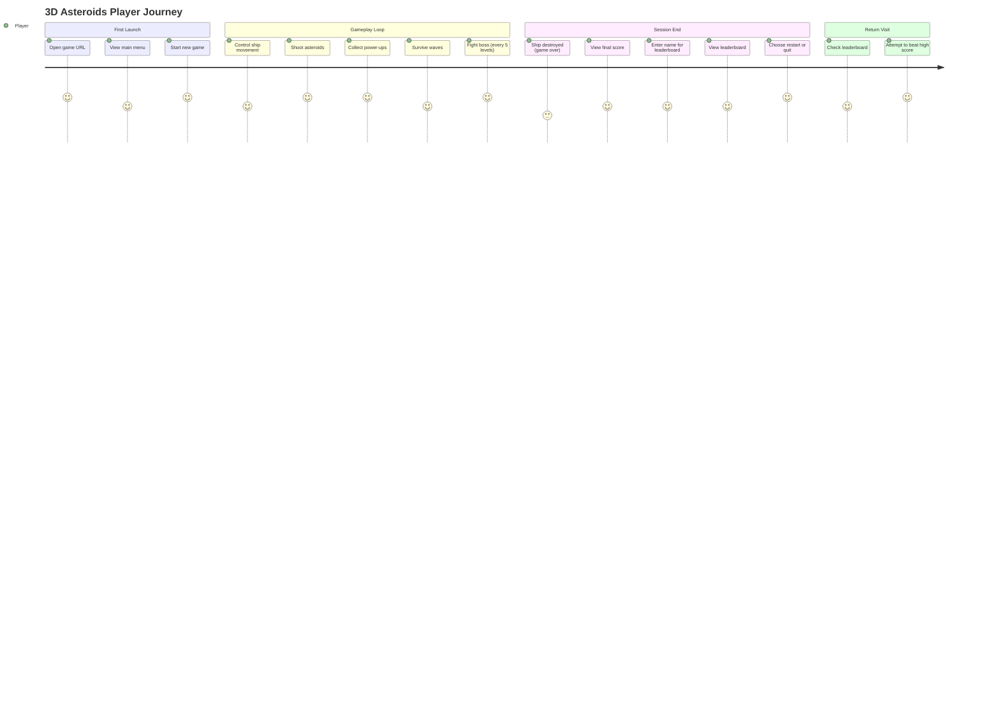
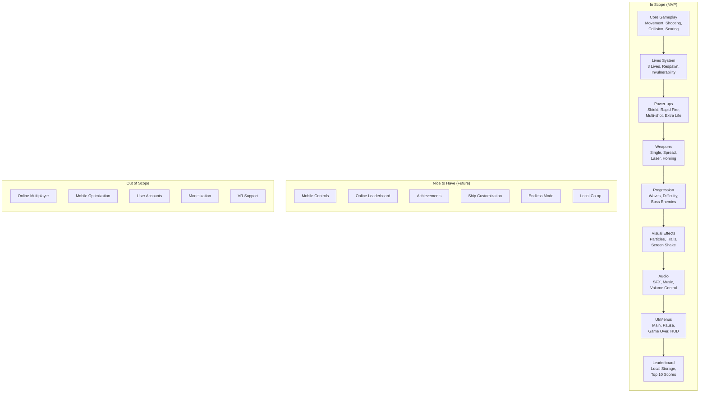
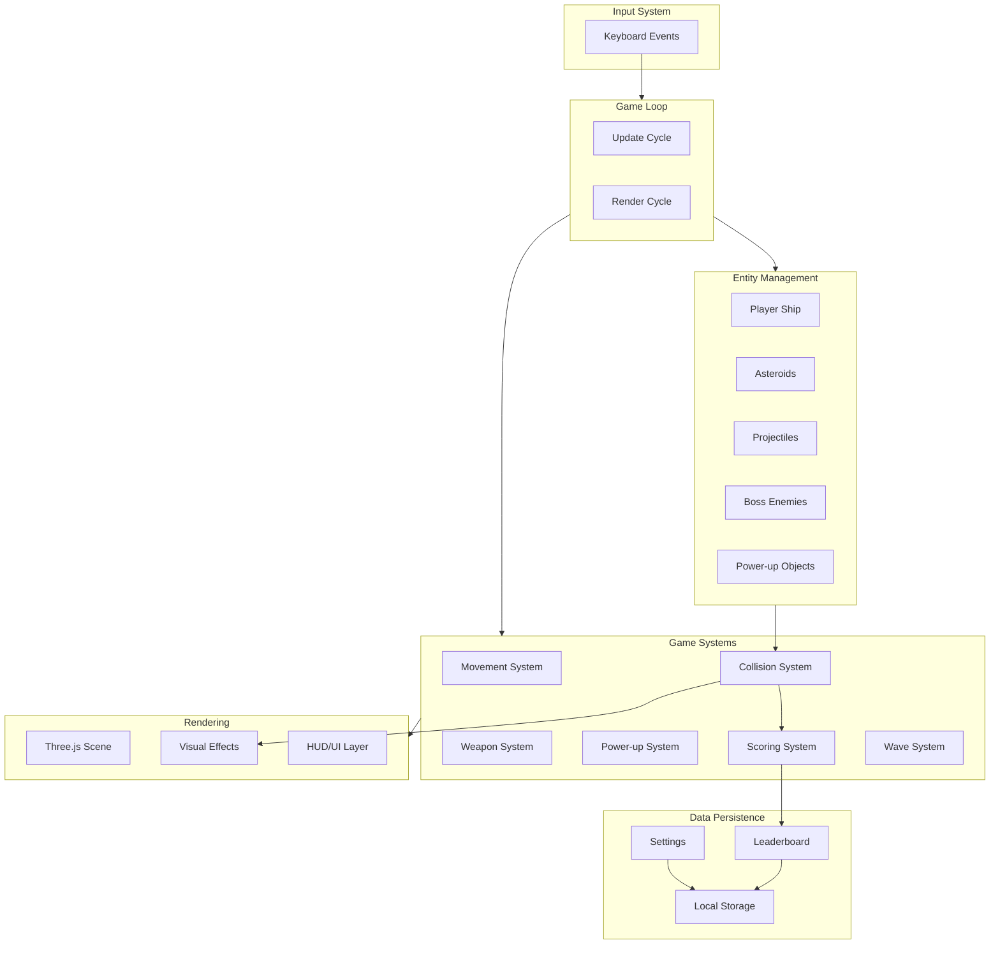

# PRD: 3D Asteroids Game

## Overview

### One-line Summary
A modern 3D browser-based Asteroids game built with Three.js, TypeScript, and Vite featuring power-ups, weapon systems, boss battles, and progression mechanics.

### Background
Classic Asteroids games have remained popular for decades due to their simple yet engaging gameplay loop. This project reimagines the classic formula with modern 3D graphics, enhanced game mechanics including power-ups, multiple weapon types, boss encounters, and progression systems. The browser-based approach eliminates installation barriers, allowing players to enjoy the game instantly on any desktop computer with a modern browser.

### Business Value
- **Zero-friction access**: No download or installation required
- **Cross-platform compatibility**: Works on any desktop browser (Chrome, Firefox, Safari, Edge)
- **Engagement through progression**: Wave-based difficulty and boss encounters encourage extended play sessions
- **Replayability**: Power-up variety and weapon systems create varied gameplay experiences

## User Stories

### Primary Users
**Casual gamers** seeking quick, engaging browser-based entertainment with modern visuals and satisfying gameplay mechanics.

### User Stories

```
As a casual gamer
I want to play a visually appealing asteroids game in my browser
So that I can enjoy quick gaming sessions without downloading software
```

```
As a player
I want to collect power-ups and unlock different weapons
So that I can feel progression and variety in my gameplay
```

```
As a competitive player
I want to see my high scores saved and displayed on a leaderboard
So that I can track my improvement and compete with myself
```

```
As a player
I want to face boss enemies with unique attack patterns
So that I experience challenging milestones in my progression
```

### Use Cases
1. **Quick Play Session**: Player opens browser, starts game from main menu, plays through several waves, achieves high score, enters name for leaderboard
2. **Progression Run**: Player attempts to reach and defeat boss enemies every 5 levels, collecting power-ups to improve survival chances
3. **High Score Challenge**: Experienced player attempts to beat their previous high score using weapon mastery and optimal power-up collection
4. **Learning Session**: New player uses main menu to start, learns controls during gameplay, uses pause menu to take breaks

## Functional Requirements

### Must Have (MVP)

#### Core Gameplay
- [ ] **Player Ship Control**: WASD/Arrow key movement with rotation-based steering
  - AC: Ship rotates with left/right keys, thrusts forward with up key, all inputs responsive within 16ms
- [ ] **Asteroid Spawning**: Asteroids spawn from screen edges with randomized trajectories
  - AC: Large asteroids split into 2-3 medium asteroids, medium into 2-3 small, small are destroyed
- [ ] **Shooting Mechanic**: Spacebar fires projectiles in facing direction
  - AC: Bullets travel at consistent velocity, despawn after leaving screen bounds or hitting target
- [ ] **Collision Detection**: Ship-asteroid and bullet-asteroid collisions detected accurately
  - AC: Collisions trigger appropriate responses (damage/destruction) within 1 frame of contact
- [ ] **Scoring System**: Points awarded for asteroid destruction with visual feedback
  - AC: Small=100pts, Medium=50pts, Large=25pts; score displays immediately with visual confirmation

#### Lives and Health System
- [ ] **Multiple Lives**: Player starts with 3 lives, loses one per ship destruction
  - AC: Lives count displayed in HUD, game over when lives reach 0
- [ ] **Visual Lives Indicator**: HUD displays remaining lives clearly
  - AC: Lives shown as ship icons or numerical display, updates immediately on change
- [ ] **Invulnerability Period**: 3-second invulnerability after respawn
  - AC: Ship visually indicates invulnerability (flashing/transparency), collision ignored during period

#### Power-up System
- [ ] **Shield Power-up**: Grants temporary invulnerability (10 seconds)
  - AC: Visual shield effect surrounds ship, absorbs all damage during duration, timer visible to player
- [ ] **Rapid Fire Power-up**: Doubles fire rate for 15 seconds
  - AC: Fire rate measurably doubles, visual/audio feedback on activation, timer visible
- [ ] **Multi-shot Power-up**: Fires 3 projectiles simultaneously for 15 seconds
  - AC: Spread pattern clearly visible, all 3 projectiles deal damage, timer visible
- [ ] **Extra Life Power-up**: Adds one life to player's total
  - AC: Lives counter increments immediately, visual/audio feedback on collection

#### Weapon System
- [ ] **Default Single Shot**: Standard projectile weapon
  - AC: Single bullet per fire input, consistent velocity and damage
- [ ] **Spread Shot**: 3-way projectile spread
  - AC: Center bullet + 2 angled bullets at 15-degree spread
- [ ] **Laser Beam**: Continuous beam weapon
  - AC: Beam active while spacebar held, instant hit detection, energy/cooldown mechanic
- [ ] **Homing Missiles**: Lock-on projectiles
  - AC: Missiles track nearest asteroid, limited ammo, slower fire rate than default

#### Level Progression
- [ ] **Wave-based Levels**: Waves increase in difficulty progressively
  - AC: Clear visual indicator when wave is cleared, next wave starts after 3-second delay
- [ ] **Asteroid Quantity Scaling**: More asteroids per wave
  - AC: Wave 1=3 asteroids, +2 per wave, capped at reasonable performance limit
- [ ] **Asteroid Speed Scaling**: Faster asteroids in later waves
  - AC: Base speed increases 5% per wave, capped at 2x base speed
- [ ] **Level HUD Indicator**: Current wave/level displayed
  - AC: Level number visible at all times, updates on wave completion

#### Boss Enemies
- [ ] **Boss Appearance**: Boss enemy appears every 5 levels
  - AC: Special announcement/warning before boss spawn, boss clearly distinguishable from asteroids
- [ ] **Unique Attack Patterns**: Each boss type has distinct behavior
  - AC: Minimum 2 boss types with different movement and attack patterns
- [ ] **Multiple Hit Points**: Boss requires sustained damage to defeat
  - AC: Boss health bar visible, requires 10+ hits to destroy (scaling with level)
- [ ] **Special Rewards**: Defeating boss grants significant rewards
  - AC: Boss awards 1000+ points, guaranteed power-up drop, weapon unlock potential

#### Visual Effects
- [ ] **Particle Explosions**: Asteroid and ship destruction creates particle effects
  - AC: Explosion particles visible for at least 0.5 seconds, scale with destroyed object size
- [ ] **Thruster Flames**: Ship engines display thrust visuals
  - AC: Flame particles emit from ship rear during forward thrust
- [ ] **Weapon Trails**: Projectiles leave visible trails
  - AC: Trail fades over distance, color matches weapon type
- [ ] **Screen Shake**: Camera shakes on significant impacts
  - AC: Ship collision and boss hits trigger screen shake, intensity proportional to event

#### Audio
- [ ] **Sound Effects**: Distinct sounds for shooting, explosions, power-up collection
  - AC: Each action has unique audio, sounds do not clip or overlap destructively
- [ ] **Background Music**: Looping ambient music during gameplay
  - AC: Music loops seamlessly, intensity can vary with game state
- [ ] **Volume Controls**: Adjustable sound and music volume
  - AC: Separate sliders for SFX and music, settings persist in local storage

#### Leaderboard
- [ ] **Local Storage Persistence**: Scores saved to browser local storage
  - AC: Scores persist across browser sessions, survive page refresh
- [ ] **Top 10 Display**: Leaderboard shows highest 10 scores
  - AC: Scores sorted descending, displays name and score
- [ ] **Name Entry**: Player enters name for high score
  - AC: Text input appears on qualifying score, 3-10 character limit

#### UI/Menus
- [ ] **Main Menu**: Title screen with play, settings, leaderboard options
  - AC: All menu items functional, clear visual feedback on selection
- [ ] **Pause Menu**: In-game pause with resume, settings, quit options
  - AC: ESC key toggles pause, game state frozen during pause
- [ ] **Game Over Screen**: Displays final score with restart/menu options
  - AC: Shows achieved score, high score status, clear navigation options
- [ ] **HUD**: Persistent display of score, lives, current weapon, level
  - AC: All elements visible without obscuring gameplay, updates in real-time

### Nice to Have

- [ ] **Mobile/Touch Controls**: On-screen virtual joystick for mobile devices
- [ ] **Online Leaderboard**: Server-persisted global leaderboard
- [ ] **Achievement System**: Unlockable achievements for milestones
- [ ] **Ship Customization**: Visual ship skins/colors
- [ ] **Endless Mode**: No boss battles, pure survival mode
- [ ] **Co-op Multiplayer**: Local 2-player mode

### Out of Scope

- **Multiplayer Networking**: Online real-time multiplayer requires server infrastructure beyond scope
- **Mobile Platform Optimization**: Initial release targets desktop browsers with keyboard controls
- **Account System**: User authentication and cloud saves require backend services
- **Monetization Features**: No in-app purchases, ads, or premium content systems
- **VR Support**: WebXR integration adds complexity beyond initial scope

## Non-Functional Requirements

### Performance
- **Frame Rate**: Consistent 60 FPS on mid-range hardware (2020+ desktop/laptop)
- **Load Time**: Initial game load under 5 seconds on broadband connection
- **Memory Usage**: Under 500MB RAM during gameplay
- **Draw Calls**: Under 100 draw calls per frame through instancing and batching

### Reliability
- **Browser Support**: Chrome 90+, Firefox 90+, Safari 15+, Edge 90+
- **Graceful Degradation**: Game remains playable if WebGPU unavailable (WebGL 2 fallback)
- **State Persistence**: Game progress saved on pause, leaderboard data survives crashes

### Security
- **Input Sanitization**: Leaderboard name entries sanitized to prevent XSS
- **Local Storage Only**: No sensitive data transmitted; all data stays client-side

### Scalability
- **Asset Loading**: Lazy-load audio and non-critical assets after initial render
- **Performance Scaling**: Reduce particle count/effects on lower-end hardware detection

## Success Criteria

### Quantitative Metrics
1. **Performance**: Maintains 60 FPS on target hardware 95% of gameplay time
2. **Load Time**: Initial load completes in under 5 seconds for 90% of users
3. **Session Length**: Average play session exceeds 5 minutes
4. **Return Rate**: Players return for additional sessions within 7 days

### Qualitative Metrics
1. **Visual Appeal**: 3D graphics feel modern and polished compared to 2D alternatives
2. **Game Feel**: Controls feel responsive and satisfying
3. **Progression Satisfaction**: Players experience sense of achievement through waves and boss defeats

## Technical Considerations

### Dependencies
- **Three.js**: 3D rendering engine (r171+, required for WebGPU renderer stability)
- **TypeScript**: Type-safe JavaScript development
- **Vite**: Build tool and development server
- **No external game frameworks**: Pure Three.js implementation for learning/control

### 3D Asset Strategy
- **Procedural Generation**: Asteroids, bullets, particles, effects (no external models needed)
- **Simple 3D Models**: Ship and boss models (can be procedural or simple GLB files)
- **Texture Approach**: Mix of procedural textures and optimized image textures
- **Compression**: Use Draco for geometry, KTX2 for textures if needed

### Rendering Approach
- **WebGPU First**: Use WebGPURenderer with automatic WebGL 2 fallback
- **Instancing**: Instance asteroids and particles to minimize draw calls
- **Efficient Lighting**: Limited dynamic lights, primarily ambient + directional

### Constraints
- **Browser-only**: No native app considerations
- **Keyboard Input**: Primary control scheme (mouse optional for menus)
- **Single-player**: No networking or real-time sync required

### Assumptions
- Users have desktop/laptop computers with discrete or modern integrated graphics
- Users have modern browsers updated within last 2 years
- Users have stable internet for initial asset loading
- Local storage is available and not blocked by browser settings

### Risks and Mitigation
| Risk | Impact | Probability | Mitigation |
|------|--------|-------------|------------|
| Performance issues on lower-end hardware | High | Medium | Implement quality settings, reduce particle counts dynamically |
| Browser compatibility issues | Medium | Low | Test on all major browsers, use feature detection with fallbacks |
| Audio loading/playback issues | Medium | Medium | Preload critical sounds, implement audio context resume for autoplay policies |
| Local storage quota exceeded | Low | Low | Limit stored data to top 10 scores only, implement data cleanup |
| WebGPU adoption gaps | Medium | Low | Automatic WebGL 2 fallback, extensive WebGL testing |

## User Journey Diagram



## Scope Boundary Diagram



## Game Systems Architecture Diagram



## Appendix

### References
- [Three.js Documentation](https://threejs.org/docs/)
- [Three.js Best Practices 2026](https://www.utsubo.com/blog/threejs-best-practices-100-tips)
- [MDN Three.js Game Development](https://developer.mozilla.org/en-US/docs/Games/Techniques/3D_on_the_web/Building_up_a_basic_demo_with_Three.js)
- [WebGPU Renderer Documentation](https://threejs.org/docs/#api/en/renderers/WebGPURenderer)

### Glossary
- **Wave**: A level/round containing a set number of asteroids that must be destroyed
- **Power-up**: Collectible item that grants temporary or permanent benefits
- **HUD**: Heads-Up Display; on-screen information overlay during gameplay
- **Instancing**: GPU technique for efficiently rendering multiple identical objects
- **Draw Call**: Single GPU rendering command; fewer is better for performance
- **WebGPU**: Modern graphics API for browsers, successor to WebGL
- **Procedural Generation**: Creating content algorithmically rather than manually

---

**Document Version**: 1.0
**Created**: 2026-01-22
**Status**: Draft
