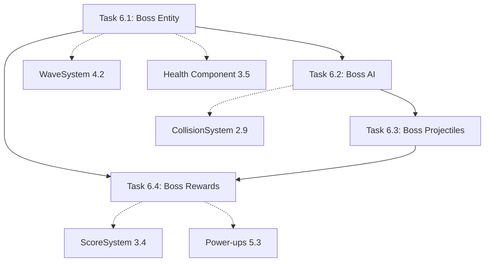

# Phase 6 Decomposition Summary: Boss System

Generation Date: 2026-01-23
Target Plan Document: work-plan-asteroids.md
Phase: 6 (Boss System)

## Phase Overview

### Purpose and Goals

Implement boss entities with AI patterns, multi-phase combat, and reward systems. Boss battles occur every 5 waves (waves 5, 10, 15, etc.) and provide challenging combat encounters with two distinct boss types: Destroyer (aggressive melee/ranged) and Carrier (minion summoning/retreat). Each boss has multiple attack patterns that alternate on a timer, phase-based difficulty scaling based on health percentage, and guaranteed rewards on defeat.

### Background and Context

This phase builds on the core gameplay loop (Phase 3) and wave progression system (Phase 4) to add depth and variety to long-term gameplay. Boss battles provide:
- Milestone events breaking up asteroid waves
- Strategic combat requiring pattern recognition
- Meaningful rewards (guaranteed power-ups, large score bonuses)
- Difficulty scaling that increases with wave progression

## Task Decomposition

### Task List

**Task 6.1: Boss Entity and Health System** (work-plan-asteroids-task-33.md)
- Size: Medium (3-4 files)
- Duration: 1 day
- Deliverables:
  - Boss entity factory (createBoss) with Destroyer and Carrier types
  - Boss component definition with phase tracking
  - BossHealthSystem monitoring health and triggering phase transitions
  - Boss health bar UI (DOM overlay)
  - WaveSystem integration for boss spawning every 5 waves
- Dependencies: Task 4.2 (Wave Progression), Task 3.5 (Lives System)
- Verification: L1 (Functional) + L2 (Tests)

**Task 6.2: Boss AI System** (work-plan-asteroids-task-34.md)
- Size: Medium (2-3 files)
- Duration: 1 day
- Deliverables:
  - BossSystem with AI pattern execution
  - Boss AI configuration with pattern definitions
  - Destroyer patterns: Charge (move toward player), Spray (strafe and fire spread)
  - Carrier patterns: Summon (spawn asteroids), Retreat (move away and fire homing)
  - Phase-based difficulty scaling (speed, fire rate, damage multipliers)
  - Pattern alternation system (3-second timer)
- Dependencies: Task 6.1 (Boss Entity), Task 2.9 (Collision System)
- Verification: L1 (Functional) + L2 (Tests)

**Task 6.3: Boss Projectiles** (work-plan-asteroids-task-35.md)
- Size: Small (2-3 files)
- Duration: 0.5 days
- Deliverables:
  - Boss projectile support in createProjectile factory
  - Boss projectile collision layer ("bossProjectile")
  - Ship-boss projectile collision handling (damage, respawn)
  - Shield blocking for boss projectiles
- Dependencies: Task 6.2 (Boss AI), Task 2.9 (Collision System)
- Verification: L1 (Functional) + L2 (Tests)

**Task 6.4: Boss Rewards** (work-plan-asteroids-task-36.md)
- Size: Small (2-3 files)
- Duration: 0.5 days
- Deliverables:
  - Boss defeat detection and cleanup
  - Guaranteed power-up spawn at boss location
  - Boss score calculation (1000 * wave level)
  - Wave continuation after boss defeat
- Dependencies: Task 6.1 (Boss Health), Task 3.4 (Scoring), Task 5.3 (Power-ups)
- Verification: L1 (Functional) + L2 (Tests)

### Execution Order

**Sequential dependencies require this order**:
1. Task 6.1 (Boss Entity and Health System) - Foundation
2. Task 6.2 (Boss AI System) - Requires boss entity to control
3. Task 6.3 (Boss Projectiles) - Requires boss AI to create projectiles
4. Task 6.4 (Boss Rewards) - Requires boss health system for defeat detection

**No parallel execution opportunities** due to sequential dependencies.

### Inter-task Relationships

### Common Processing Points

**Identified shared components across tasks**:

1. **Boss Entity Reference**
   - Defined in Task 6.1 (createBoss factory)
   - Used by: Task 6.2 (AI control), Task 6.3 (projectile ownership), Task 6.4 (defeat rewards)
   - Design policy: Single boss entity active at a time

2. **Phase System**
   - Defined in Task 6.1 (Boss component phase field)
   - Used by: Task 6.2 (AI modifiers), Task 6.3 (damage scaling)
   - Design policy: Phase 1 (100-51%), Phase 2 (50-26%), Phase 3 (25-0%)

3. **Boss Projectile Layer**
   - Defined in Task 6.3 (collision layer "bossProjectile")
   - Created by: Task 6.2 (during attack patterns)
   - Collision handled: Task 6.3 (ship damage)
   - Design policy: Distinct layer from player projectiles

4. **Event System Integration**
   - Events emitted: bossPhaseChanged, bossDamaged, bossDefeated, bossPatternChanged
   - Listeners: BossSystem, ScoreSystem, WaveSystem, AudioSystem (future)
   - Design policy: Event-driven communication between systems

5. **Boss Configuration**
   - Defined in Task 6.1 (health scaling), Task 6.2 (AI patterns)
   - Used by: All boss tasks for parameter tuning
   - Design policy: Centralized configuration for easy balancing

**Prevention of duplicate implementation**:
- Boss entity created once in Task 6.1, referenced everywhere else
- Phase transition logic centralized in BossHealthSystem
- Projectile creation uses existing createProjectile factory (extended, not duplicated)
- Score calculation centralized in ScoreSystem (extended for boss)
- Power-up spawning uses existing createPowerUp factory

## Implementation Strategy

### Vertical Slice Approach

Phase 6 follows vertical slice methodology:
- Task 6.1: Foundation (boss entity, health, spawning)
- Task 6.2: Core behavior (AI patterns, movement)
- Task 6.3: Combat mechanics (boss projectiles, damage)
- Task 6.4: Completion and rewards (defeat logic, power-ups)

Each task adds incremental playable value:
- After 6.1: Boss spawns and displays health bar (non-interactive)
- After 6.2: Boss executes attack patterns and moves
- After 6.3: Boss can damage player, full combat loop
- After 6.4: Boss encounter complete with rewards

### Verification Levels

All tasks use **L1 (Functional) + L2 (Tests)** verification:
- L1: Boss battles playable at each task completion
- L2: Unit tests passing for all boss systems

### Integration Points

**Phase 5 → Phase 6**:
- Power-up system established (shield blocks boss projectiles)
- Weapon variants available (needed for boss combat)
- Audio system ready (boss sound effects)

**Phase 6 → Phase 7**:
- Boss defeat triggers particle effects
- Boss attack patterns use visual effects (trails, explosions)
- Boss health bar UI established

**E2E Test Coverage**:
- E2E-12: Boss encounter (spawning, combat, defeat)

## Risk Management

### Risks Specific to Phase 6

| Risk | Impact | Probability | Mitigation |
|------|--------|-------------|-----------|
| Boss AI too complex or buggy | High - broken boss encounters | Medium | Start with 2 patterns minimum, extensive testing |
| Boss difficulty imbalanced | Medium - too easy/hard | Medium | Configurable parameters, playtesting at multiple waves |
| Performance degradation (boss + projectiles + asteroids) | Medium - FPS drop | Low | Object pooling, spatial grid for collisions |
| Boss patterns feel repetitive | Low - boring encounters | Medium | Variety in patterns, phase-based changes |

### Mitigation Strategies

1. **AI Complexity**: Minimum 2 patterns per boss, simple state machine
2. **Balance**: All parameters in config, easy tuning without code changes
3. **Performance**: Limit boss projectiles (max 10 active), reuse existing pooling
4. **Variety**: Phase system changes behavior, different bosses every 5 waves

## Quality Standards

### Testing Requirements

Each task requires:
- **Unit tests**: 10-15+ test cases per task
- **Coverage**: Boss systems covered at 70%+
- **Edge cases**: Boss at boundaries, rapid phase changes, defeat scenarios

### Performance Targets

- Boss + projectiles + asteroids: maintain 60 FPS
- Boss AI update: < 2ms per frame
- Boss health bar update: only on change (not every frame)

### Code Quality

- No Biome lint errors
- TypeScript strict mode passes
- Boss configuration externalized
- No magic numbers in boss logic

## Phase Completion Criteria

Phase 6 is complete when:

### Functionality
- [ ] Boss spawns at wave 5, 10, 15, etc.
- [ ] Boss health bar visible and updates
- [ ] Boss executes attack patterns (Charge, Spray, Summon, Retreat)
- [ ] Attack patterns alternate every 3 seconds
- [ ] Boss phase transitions at 50% and 25% health
- [ ] Boss projectiles damage player
- [ ] Shield blocks boss projectile damage
- [ ] Boss can be defeated by player fire
- [ ] Boss defeat spawns guaranteed power-up
- [ ] Boss defeat awards score (1000 * wave)
- [ ] Next wave begins after boss defeat

### Testing
- [ ] All unit tests passing (40+ tests across 4 tasks)
- [ ] E2E-12 (Boss encounter) passing
- [ ] No critical bugs in playtesting

### Quality
- [ ] Boss system performance within budget (60 FPS)
- [ ] Boss encounters feel challenging but fair
- [ ] Boss variety apparent (Destroyer vs Carrier distinct)
- [ ] Build succeeds with no errors
- [ ] Type checking passes

## Next Steps

After Phase 6 completion:
1. **Phase 7 (Visual Polish)**: Add particle effects for boss attacks, explosions, and phase transitions
2. **Integration Testing**: Verify boss encounters work with all power-ups and weapons
3. **Balance Pass**: Tune boss health, damage, and pattern timing based on playtesting

---

**Document Version**: 1.0
**Generated**: 2026-01-23
**Status**: Ready for Implementation
**Total Tasks**: 4
**Total Estimated Duration**: 3-4 days
**Verification Level**: L1 (Functional) + L2 (Tests)
