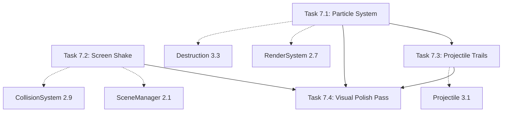

# Phase 7 Decomposition Summary: Visual Polish

Generation Date: 2026-01-23
Target Plan Document: work-plan-asteroids.md
Phase: 7 (Visual Polish)

## Phase Overview

### Purpose and Goals

Implement visual effects and polish to enhance gameplay feedback, improve aesthetic appeal, and create a cohesive cyberpunk/neon visual theme. Add particle systems for explosions and thrust, screen shake for impact feedback, projectile trails for weapon distinction, and final material/lighting polish for production-ready visual quality. All visual enhancements must maintain 60 FPS performance target.

### Background and Context

This phase builds on the complete gameplay implementation (Phases 1-6) to add visual polish that enhances player feedback and creates a distinctive aesthetic. Visual effects serve functional purposes:
- **Particles**: Provide destruction feedback, indicate thrust, enhance immersion
- **Screen Shake**: Communicate impact severity, reinforce collision feedback
- **Projectile Trails**: Aid weapon identification, improve projectile visibility
- **Material Polish**: Create cohesive visual theme, enhance entity distinction

Phase 7 is the final implementation phase before Quality Assurance (Phase 8).

## Task Decomposition

### Task List

**Task 7.1: Particle System - Explosions and Effects** (work-plan-asteroids-task-37.md)
- Size: Medium (4-5 files)
- Duration: 1 day
- Deliverables:
  - ParticleManager with 500-particle object pool
  - ParticleEmitterSystem for explosion and thrust particle spawning
  - ParticleRenderSystem with instanced mesh rendering and billboarding
  - Explosion particles on asteroid destruction (20-50 count, size-dependent duration)
  - Thrust trail particles from ship rear (50/second emission rate)
  - Particle fade over lifetime with color gradients
- Dependencies: Task 2.7 (Render System), Task 3.3 (Asteroid Destruction)
- Verification: L2 (Tests) + L1 (Functional)

**Task 7.2: Screen Shake Camera Effect** (work-plan-asteroids-task-38.md)
- Size: Small (2-3 files)
- Duration: 0.5 days
- Deliverables:
  - CameraEffectSystem for collision-based screen shake
  - Magnitude scaling by impact severity (ship-asteroid: 5, ship-boss: 7, projectile-asteroid: 2)
  - Shake stacking for multiple simultaneous impacts
  - 100ms shake duration with exponential decay
  - Configurable intensity via VisualConfig
- Dependencies: Task 2.1 (Renderer Setup), Task 2.9 (Collision System)
- Verification: L2 (Tests) + L1 (Functional)

**Task 7.3: Projectile Trails** (work-plan-asteroids-task-39.md)
- Size: Small (2-3 files)
- Duration: 0.5 days
- Deliverables:
  - Projectile trail emission in ParticleEmitterSystem
  - Weapon-type-based trail colors (red: default, blue: spread, cyan: laser, green: homing)
  - Trail particles with 20/second emission rate and 100-200ms lifetime
  - Reuses ParticleManager pool from Task 7.1
- Dependencies: Task 3.1 (Projectile Entity), Task 7.1 (Particle System)
- Verification: L2 (Tests) + L1 (Functional)

**Task 7.4: Visual Polish Pass** (work-plan-asteroids-task-40.md)
- Size: Medium (3-5 files)
- Duration: 1 day
- Deliverables:
  - Enhanced material definitions with emissive properties for all entity types
  - Dynamic visual effects (ship invulnerability pulse, boss phase color shift, power-up rotation)
  - Refined lighting setup (DirectionalLight + AmbientLight)
  - Consistent cyberpunk/neon visual theme (blue/cyan primary, orange/red warnings)
  - HUD styling consistency
  - Visual theme constants in configuration
- Dependencies: Task 7.1 (Particles), Task 7.2 (Screen Shake), Task 7.3 (Trails)
- Verification: L2 (Tests) + L1 (Functional)

### Execution Order

**Sequential dependencies require this order**:
1. **Task 7.1** (Particle System) - Foundation for trails
2. **Task 7.2** (Screen Shake) - Independent, can run parallel with 7.1
3. **Task 7.3** (Projectile Trails) - Requires ParticleManager from 7.1
4. **Task 7.4** (Visual Polish Pass) - Final polish after all effects implemented

**Parallel execution opportunity**: Tasks 7.1 and 7.2 can be executed in parallel (no dependencies between them).

### Inter-task Relationships

### Common Processing Points

**Identified shared components across tasks**:

1. **ParticleManager (Task 7.1)**
   - Defined in Task 7.1 (500-particle pool, instanced mesh rendering)
   - Used by: Task 7.3 (projectile trails), Task 7.4 (visual verification)
   - Design policy: Single shared particle pool for all effects

2. **Event System Integration**
   - Events listened: asteroidDestroyed, shipThrust, collision
   - Listeners: ParticleEmitterSystem (7.1), CameraEffectSystem (7.2)
   - Design policy: Event-driven visual feedback

3. **Visual Configuration (Task 7.4)**
   - Defined in Task 7.4 (visual theme constants)
   - Used by: Task 7.1 (particle colors), Task 7.2 (shake intensity), Task 7.3 (trail colors)
   - Design policy: Centralized visual configuration for easy theming

4. **Three.js Scene Access**
   - Accessed by: ParticleRenderSystem (7.1), CameraEffectSystem (7.2), RenderSystem updates (7.4)
   - Design policy: All visual effects coordinate through SceneManager

5. **Instanced Mesh Pattern**
   - Established in Task 7.1 (particle instanced mesh)
   - Performance optimization for rendering many similar objects
   - Design policy: Reuse instanced mesh pattern where applicable

**Prevention of duplicate implementation**:
- Particle pool created once in Task 7.1, reused in Task 7.3
- Event subscription centralized in respective systems (no duplicate listeners)
- Material definitions enhanced in Task 7.4 (no per-task material changes)
- Camera access through SceneManager (no direct scene manipulation)
- Visual theme constants centralized in config (no hardcoded colors in later tasks)

## Implementation Strategy

### Vertical Slice Approach

Phase 7 follows incremental visual enhancement:
- Task 7.1: Core visual feedback (particles)
- Task 7.2: Impact feedback (screen shake)
- Task 7.3: Weapon clarity (trails)
- Task 7.4: Overall polish (materials, lighting, theme)

Each task adds visible incremental value:
- After 7.1: Explosions and thrust trails visible
- After 7.2: Screen shake on collisions
- After 7.3: Projectiles have colored trails
- After 7.4: Cohesive visual theme, production-ready appearance

### Verification Levels

All tasks use **L2 (Tests) + L1 (Functional)** verification:
- L2: Unit tests passing for all visual systems
- L1: Visual effects visible and performant in gameplay

### Integration Points

**Phase 6 → Phase 7**:
- Boss system established (boss visual enhancements in 7.4)
- All gameplay features complete (visual polish adds no gameplay changes)
- Event system mature (particles and shake hook into events)

**Phase 7 → Phase 8**:
- All visual effects complete
- Performance optimization focus (ensure 60 FPS maintained)
- Visual QA (check for artifacts, consistency)

**E2E Test Coverage**:
- Visual effects verified in existing E2E tests
- No new E2E tests required (visual polish only)

## Risk Management

### Risks Specific to Phase 7

| Risk | Impact | Probability | Mitigation |
|------|--------|-------------|-----------|
| Particle pool insufficient (500 too small) | Medium - visual effects cut off | Low | Pool expansion logic, emission rate tuning |
| Performance degradation with many particles | High - FPS drop below 60 | Medium | Object pooling, instanced mesh rendering, particle limit enforcement |
| Visual theme inconsistency | Low - aesthetics suboptimal | Medium | Centralized color palette, visual audit in 7.4 |
| Screen shake too intense or subtle | Low - poor feedback | Medium | Configurable intensity, playtesting, magnitude tuning |
| Trail colors not distinct enough | Low - weapon confusion | Low | High-contrast colors (red/blue/cyan/green) |

### Mitigation Strategies

1. **Performance**: Object pooling (Task 7.1), instanced mesh rendering, particle count limits
2. **Pool Capacity**: Calculate max particles needed (explosions + thrust + trails = ~350), 500 pool sufficient with 30% buffer
3. **Theme Consistency**: Visual audit in Task 7.4, color palette constants, HUD styling pass
4. **Feedback Tuning**: Configurable shake intensity, emission rates, playtesting validation
5. **Color Distinction**: High-contrast color palette, avoid similar hues

## Quality Standards

### Testing Requirements

Each task requires:
- **Unit tests**: 10-20+ test cases per task
- **Coverage**: Visual systems covered at 70%+
- **Edge cases**: Pool exhaustion, rapid events, multi-effect stacking

### Performance Targets

- Particle rendering: 60 FPS with 500 active particles
- Screen shake: <0.5ms calculation overhead
- Trail emission: no additional draw calls (reuse instanced mesh)
- Overall: maintain 60 FPS with all visual effects active

### Code Quality

- No Biome lint errors
- TypeScript strict mode passes
- Visual configuration externalized
- No magic numbers in visual logic

## Phase Completion Criteria

Phase 7 is complete when:

### Functionality
- [ ] Particle system operational with 500-particle pool
- [ ] Explosion particles spawn on asteroid destruction (20-50 count)
- [ ] Explosion duration scales with entity size (0.5-2s)
- [ ] Thrust particles emit from ship rear (50/second)
- [ ] Particles fade over lifetime
- [ ] Screen shake on collisions (magnitude scales with severity)
- [ ] Screen shake stacks for multiple impacts
- [ ] Projectile trails emit with weapon-specific colors
- [ ] Trail colors: red (default), blue (spread), cyan (laser), green (homing)
- [ ] All materials enhanced with emissive properties
- [ ] Ship pulses during invulnerability (5 Hz)
- [ ] Boss color shifts with phase (blue → orange → red)
- [ ] Power-ups rotate continuously (π/2 rad/s)
- [ ] Visual theme consistent (cyberpunk/neon)
- [ ] HUD styling matches theme

### Testing
- [ ] All unit tests passing (50+ tests across 4 tasks)
- [ ] No visual artifacts (Z-fighting, clipping)
- [ ] Visual verification in gameplay

### Performance
- [ ] 60 FPS maintained with all visual effects active
- [ ] Draw calls < 100 (instanced mesh optimization)
- [ ] Particle rendering < 5ms per frame
- [ ] Screen shake < 0.5ms per frame

### Quality
- [ ] Build succeeds with no errors
- [ ] Type checking passes
- [ ] Visual theme cohesive and appealing
- [ ] Player feedback clear (explosions, shake, trails)

## Implementation Considerations

### Particle Pool Capacity Analysis

Max particle calculations:
- **Explosions**: 10 simultaneous asteroids * 35 particles avg = 350 particles
- **Thrust**: 1 ship * 50/sec * 0.2s avg lifetime = 10 particles
- **Trails**: 50 projectiles * 20/sec * 0.15s avg lifetime = 150 particles
- **Total Max**: 350 + 10 + 150 = 510 particles
- **Pool Size**: 500 (98% capacity at peak, acceptable with some cutoff)
- **Mitigation**: Limit explosion particle count per frame if pool exhausted

### Color Palette Rationale

Cyberpunk/neon theme chosen for:
- High visibility against dark space background
- Distinct weapon identification (trails)
- Modern aesthetic matching 3D graphics
- Phase distinction (boss color shift)

Primary colors:
- Blue/Cyan: Cool, technological, primary theme
- Orange/Red: Warm, warning, danger escalation
- Green: Success, collection, homing weapon
- Magenta/Yellow: Accent, power-ups

### Performance Optimization Patterns

1. **Object Pooling**: Eliminate allocations during gameplay
2. **Instanced Mesh Rendering**: Single draw call for all particles
3. **Lazy Updates**: Material properties updated only on change
4. **Event-Driven**: Visual effects triggered by events, not polling
5. **Configurable Limits**: Particle counts and emission rates tunable

## Next Steps

After Phase 7 completion:
1. **Phase 8 (Quality Assurance)**: Performance profiling, cross-browser testing, E2E test execution
2. **Visual QA**: Check for artifacts, theme consistency, effect clarity
3. **Performance Tuning**: Optimize if FPS drops below 60, adjust particle limits
4. **Balance Pass**: Fine-tune shake intensity, particle counts, emission rates based on playtesting

---

**Document Version**: 1.0
**Generated**: 2026-01-23
**Status**: Ready for Implementation
**Total Tasks**: 4
**Total Estimated Duration**: 2-3 days (with parallel execution)
**Verification Level**: L2 (Tests) + L1 (Functional)
**Performance Target**: 60 FPS maintained with all visual effects active
