# Work Plan: 3D Asteroids Game Implementation

**Status**: Not Started
**Created**: 2026-01-22
**Last Updated**: 2026-01-22
**Target Completion**: 2026-Q2
**Implementation Strategy**: Vertical Slice (Feature-driven)
**Test Strategy**: Test-Driven Development with E2E verification at integration points

---

## Table of Contents

1. [Overview and Objectives](#overview-and-objectives)
2. [Prerequisites and Setup](#prerequisites-and-setup)
3. [Phase Breakdown and Dependencies](#phase-breakdown-and-dependencies)
4. [Phase 1: Foundation](#phase-1-foundation)
5. [Phase 2: Minimal Playable Game](#phase-2-minimal-playable-game)
6. [Phase 3: Core Gameplay Loop](#phase-3-core-gameplay-loop)
7. [Phase 4: Game Flow and Progression](#phase-4-game-flow-and-progression)
8. [Phase 5: Enhanced Features](#phase-5-enhanced-features)
9. [Phase 6: Boss System](#phase-6-boss-system)
10. [Phase 7: Visual Polish](#phase-7-visual-polish)
11. [Phase 8: Quality Assurance](#phase-8-quality-assurance)
12. [Risk Management](#risk-management)
13. [Verification Procedures](#verification-procedures)

---

## Overview and Objectives

### Project Summary

Implement a modern 3D browser-based Asteroids game using Three.js, TypeScript, and Vite with:
- Entity-Component-System (ECS) architecture
- Custom arcade physics engine
- Power-up and weapon systems
- Boss battles with AI patterns
- Progressive wave-based difficulty scaling
- Audio and visual effects with particles
- Local leaderboard persistence

### Key Objectives

1. **Create a playable, engaging game** with smooth 60 FPS performance
2. **Implement modular architecture** allowing feature iteration
3. **Achieve 70%+ test coverage** with unit and integration tests
4. **Deliver visual polish** with particles, effects, and animations
5. **Ensure cross-browser compatibility** (Chrome, Firefox, Safari, Edge)

### Success Criteria

- [ ] All acceptance criteria from Design Doc achieved
- [ ] 60 FPS maintained on mid-range hardware (95% of gameplay)
- [ ] <100 draw calls per frame
- [ ] <5 second initial load on broadband
- [ ] All E2E test scenarios passing
- [ ] 70%+ code coverage (statements, branches, functions, lines)
- [ ] Zero critical bugs in final QA

---

## Prerequisites and Setup

### Required Setup (Before Phase 1)

- [ ] Confirm Vite and TypeScript build tooling installed
- [ ] Verify Node.js 18+ environment
- [ ] Review Design Doc sections: Architecture, Type Definitions, Integration Points
- [ ] Review all ADRs (ADR-0001 through ADR-0005)
- [ ] Ensure E2E test skeleton generated at `tests/e2e/asteroids.e2e.test.ts`
- [ ] Ensure integration test skeleton generated at `tests/integration/asteroids.int.test.ts`

### Initial Dependencies to Install

- **Three.js r171+** (WebGPU renderer support)
- **Howler.js** (audio management)
- **Vitest** (unit/integration testing)
- **Playwright** (E2E testing framework - future integration)

### Project Structure Pre-Flight Check

```
asteroids/
├── docs/plans/
│   └── work-plan-asteroids.md        (THIS FILE)
├── docs/design/
│   └── design-asteroids.md           (REFERENCE)
├── tests/
│   ├── e2e/
│   │   └── asteroids.e2e.test.ts    (15 E2E test skeletons)
│   └── integration/
│       └── asteroids.int.test.ts    (3 integration test skeletons)
└── src/
    └── (created during Phase 1)
```

---

## Phase Breakdown and Dependencies

### Implementation Approach: Vertical Slice (Feature-Driven)

Each phase delivers a complete, playable vertical slice of functionality:

```mermaid
graph LR
    Phase1["Phase 1: Foundation<br/>(Types, ECS, Build)"]
    Phase2["Phase 2: Minimal Game<br/>(Ship, Asteroids, Collision)"]
    Phase3["Phase 3: Core Loop<br/>(Weapons, Scoring, Lives)"]
    Phase4["Phase 4: Game Flow<br/>(Menus, Waves, FSM)"]
    Phase5["Phase 5: Enhanced<br/>(Audio, Power-ups, Weapons)"]
    Phase6["Phase 6: Boss System<br/>(Boss AI, Patterns)"]
    Phase7["Phase 7: Visual Polish<br/>(Particles, Effects)"]
    Phase8["Phase 8: QA<br/>(Testing, Optimization)"]

    Phase1 --> Phase2
    Phase2 --> Phase3
    Phase3 --> Phase4
    Phase4 --> Phase5
    Phase5 --> Phase6
    Phase6 --> Phase7
    Phase7 --> Phase8
```



### Verification Levels

- **L1 (Functional)**: Feature is end-user playable
- **L2 (Test)**: Tests passing, coverage requirements met
- **L3 (Build)**: No TypeScript/build errors

### Test Implementation Strategy

**Test Placement Principles**:
1. **Unit Tests (Phase 0 Red state)**: Created alongside Phase 1-2 implementations
2. **Integration Tests**: Created/executed when system components interact (Phase 2-3)
3. **E2E Tests**: Executed in final phase after implementation complete

**Integration Test Timeline**:
- INT-1, INT-2, INT-3: Execute during Phase 4 (after system pipeline complete)

**E2E Test Timeline**:
- E2E-1 through E2E-15: Execute during Phase 8 (after all features implemented)

---

## Phase 1: Foundation

**Objectives**: Establish build tooling, core ECS infrastructure, and type system
**Duration**: 2-3 days
**Verification Level**: L3 (Build Success)
**Dependent Phases**: All subsequent phases

### Tasks

#### Task 1.1: Project Setup and Build Configuration
**Dependencies**: None
**Status**: - [x] COMPLETED (2026-01-22)

**Description**: Initialize Vite configuration, TypeScript configuration, package.json dependencies, and directory structure.

**Implementation Steps**:
1. Configure `vite.config.ts` with Three.js module resolution and asset handling
2. Configure `tsconfig.json` with strict mode enabled, targeting ES2020
3. Install core dependencies: Three.js r171+, Howler.js, Vitest, dev tooling
4. Create directory structure: `src/`, `tests/`, `public/assets/`
5. Create `index.html` with canvas element and script entry point

**Completion Criteria**:
- [x] `npm run build` succeeds with no errors
- [x] `npm run type-check` passes
- [x] All directories created
- [x] Entry point `src/main.ts` exists and can be loaded

**Quality Checks**:
```bash
npm run build
npm run type-check
```

---

#### Task 1.2: Core ECS Implementation and World
**Dependencies**: Task 1.1
**Status**: - [x] COMPLETED (2026-01-22)

**Description**: Implement ECS infrastructure: Entity Manager, Component Storage, System Manager, and World orchestrator.

**Implementation Steps**:
1. Create `src/ecs/EntityManager.ts` with entity creation/destruction, ID allocation
2. Create `src/ecs/ComponentStorage.ts` with component archetype storage
3. Create `src/ecs/SystemManager.ts` with system registration and update orchestration
4. Create `src/ecs/World.ts` with public interface for entity/component/system operations
5. Export public API from `src/ecs/index.ts`
6. Create unit tests for each ECS class (Red state)

**Completion Criteria**:
- [x] ECS World can create/destroy entities
- [x] Components can be added/removed/queried from entities
- [x] Systems can be registered and updated in order
- [x] Unit tests created and passing (4+ test files)

**Test Coverage**: Unit tests for World, EntityManager, ComponentStorage operations

**Quality Checks**:
```bash
npm run build
npm run type-check
npm test
```

---

#### Task 1.3: Type Definitions System
**Dependencies**: Task 1.1
**Status**: - [x] COMPLETED (2026-01-22)

**Description**: Create all TypeScript interfaces and type definitions from Design Doc Type Definitions section.

**Implementation Steps**:
1. Create `src/types/ecs.ts`: Core ECS types (EntityId, Component, System, World interface)
2. Create `src/types/components.ts`: All component interfaces (Transform, Velocity, Physics, Collider, Health, Renderable, Weapon, PowerUpEffect, Asteroid, Boss, Projectile, Player, ParticleEmitter)
3. Create `src/types/game.ts`: Game state types (GameFlowState, GameFlowEvent, GameStateData, GameSettings, LeaderboardEntry)
4. Create `src/types/events.ts`: Event types (GameEvent, GameEventType, CollisionEvent)
5. Create `src/config/gameConfig.ts`: Game configuration interface
6. Export all types from `src/types/index.ts`

**Completion Criteria**:
- [x] All type definitions from Design Doc implemented
- [x] No circular dependencies detected
- [x] TypeScript strict mode passes (for types; pre-existing errors in other files)
- [x] Type definitions exportable from `src/types/index.ts`

**Quality Checks**:
```bash
npm run type-check
npm run check:deps
```

---

#### Task 1.4: Configuration Constants
**Dependencies**: Task 1.3
**Status**: - [x] COMPLETED (2026-01-22)

**Description**: Implement game configuration with all physics, gameplay, audio, and visual constants.

**Implementation Steps**:
1. Create `src/config/gameConfig.ts` with GameConfig interface and default values:
   - Physics: ship acceleration (0.5), max speed (300), rotation speed (π rad/s), damping (0.99)
   - Gameplay: initial lives (3), invulnerability duration (3000ms), wave transition (3000ms), scoring, power-up durations
   - Audio: sound file paths, default volumes
   - Visual: particle counts, screen shake parameters
2. Create `src/config/audioConfig.ts` with sound definitions (shoot, explosion, powerup, thrust, music)
3. Add configuration exports to `src/config/index.ts`

**Completion Criteria**:
- [x] All physics constants defined and match Design Doc specs
- [x] All gameplay constants match AC requirements
- [x] Configuration values are used throughout (not hardcoded elsewhere)
- [x] Configuration is type-safe and exported

**Quality Checks**:
```bash
npm run type-check
npm run build
```

---

#### Task 1.5: Utility Implementations (Math, Random, Events)
**Dependencies**: Task 1.1
**Status**: - [x] COMPLETED (2026-01-22)

**Description**: Implement utility functions for math operations, random number generation, and event emission.

**Implementation Steps**:
1. Create `src/utils/math.ts` with:
   - Vector operations (Three.js Vector2/Vector3 utilities)
   - Rotation calculations
   - Distance and magnitude calculations
   - Angle/direction conversion functions
2. Create `src/utils/random.ts` with seeded random number generation
3. Create `src/utils/EventEmitter.ts` with event subscription/publication system
4. Create unit tests for utilities (Red state)

**Completion Criteria**:
- [x] Math utilities handle edge cases (zero vectors, angle wrapping)
- [x] Random generation works with optional seeding
- [x] EventEmitter supports subscribe/unsubscribe/publish
- [x] Unit tests passing for all utilities

**Test Coverage**: Math operations, event emission patterns

**Quality Checks**:
```bash
npm run type-check
npm test
```

---

### Phase 1 Verification

**Integration Point 1 Setup Check**:
- [x] ECS World operational (entities can be created/destroyed)
- [x] All types compile without errors
- [x] Configuration loaded successfully
- [x] Utilities testable and working

**Build Status**: ✓ Phase 1 builds successfully
**Test Status**: ✓ Unit tests passing (ECS, utilities)

---

## Phase 2: Minimal Playable Game

**Objectives**: Create minimal playable game with ship, asteroids, collision, and rendering
**Duration**: 3-4 days
**Verification Level**: L1 (Functional - player can move ship and see asteroids)
**Dependent Phases**: Phase 3 (weapons), Phase 5+ (enhancements)

### Tasks

#### Task 2.1: Three.js Renderer Setup with WebGPU Support
**Dependencies**: Task 1.1, Task 1.4
**Status**: - [x] COMPLETED (2026-01-22)

**Description**: Initialize Three.js WebGPURenderer with fallback to WebGL 2, scene setup, camera, and lighting.

**Implementation Steps**:
1. Create `src/rendering/SceneManager.ts`:
   - Initialize WebGPURenderer async with WebGL 2 fallback
   - Create PerspectiveCamera (60° FOV, positioned for 2.5D gameplay)
   - Create Scene with proper lighting setup (DirectionalLight + AmbientLight)
   - Handle canvas resizing and viewport management
   - Configure renderer pixel ratio and anti-aliasing

2. Create `src/game/Game.ts` main class:
   - Initialize SceneManager
   - Set up requestAnimationFrame loop
   - Implement fixed-timestep physics with variable rendering
   - Manage game state transitions

3. Create `src/main.ts` entry point:
   - Initialize Game instance
   - Handle window load event
   - Start game loop

**Completion Criteria**:
- [x] WebGPURenderer initializes (or falls back to WebGL 2)
- [x] Scene renders without errors
- [x] Canvas responds to window resize
- [x] Game loop runs at target FPS

**Quality Checks**:
```bash
npm run build
npm run type-check
```

**Performance Baseline**: Verify 60 FPS with empty scene

---

#### Task 2.2: Input System Implementation
**Dependencies**: Task 1.1, Task 1.4
**Status**: - [x] COMPLETED (2026-01-22)

**Description**: Implement keyboard input handling for movement and actions.

**Implementation Steps**:
1. Create `src/systems/InputSystem.ts`:
   - Track key down/up states for WASD, Arrow keys, Spacebar, ESC
   - Maintain InputState with movement (Vector2) and actions (Set<Action>)
   - Implement getMovementInput() returning normalized direction
   - Implement getActions() returning current frame actions

2. Register keyboard event listeners on document
3. Create unit tests for input state tracking (Red state)

**Completion Criteria**:
- [x] Keyboard input tracked accurately
- [x] Movement vector normalized correctly
- [x] Action set updated per frame
- [x] Unit tests passing for input logic

**Test Coverage**: Key state tracking, movement normalization

**Quality Checks**:
```bash
npm run type-check
npm test
```

---

#### Task 2.3: Component Definitions
**Dependencies**: Task 1.3
**Status**: - [x] COMPLETED (2026-01-22)

**Description**: Implement component classes for Transform, Velocity, Physics, Collider, and Renderable.

**Implementation Steps**:
1. Create `src/components/Transform.ts` with position, rotation, scale (Vector3)
2. Create `src/components/Velocity.ts` with linear and angular velocity
3. Create `src/components/Physics.ts` with mass, damping, maxSpeed, wrapScreen flags
4. Create `src/components/Collider.ts` with shape, radius/size, collision layer and mask
5. Create `src/components/Renderable.ts` with meshType, material, visibility, Three.js sync ID
6. Create `src/components/Health.ts` with current/max health, invulnerability timer
7. Create `src/components/Player.ts` with lives and score
8. Export components from `src/components/index.ts`

**Completion Criteria**:
- [x] All component classes implement Component interface
- [x] Components are pure data (no logic)
- [x] Type safety enforced (strict TypeScript)
- [x] Components exportable from index

**Quality Checks**:
```bash
npm run type-check
```

---

#### Task 2.4: Physics System Implementation
**Dependencies**: Task 2.3, Task 1.4
**Status**: - [x] COMPLETED (2026-01-22)

**Description**: Implement physics system for entity movement, velocity, damping, and screen wrapping.

**Implementation Steps**:
1. Create `src/systems/PhysicsSystem.ts`:
   - Update entity positions based on velocity and deltaTime
   - Apply damping to reduce velocity each frame
   - Enforce max speed limits
   - Implement screen wrapping (toroidal topology)
   - Handle different physics modes per entity (physics component controls)

2. Create unit tests for physics calculations (Red state):
   - Position updates with velocity
   - Damping reduces velocity exponentially
   - Screen wrapping coordinates
   - Max speed enforcement

**Completion Criteria**:
- [x] Entities move according to velocity
- [x] Damping smoothly reduces speed
- [x] Screen wrapping works at all boundaries
- [x] Unit tests passing

**Test Coverage**: Position update, damping, wrapping, max speed

**Quality Checks**:
```bash
npm run type-check
npm test
```

---

#### Task 2.5: Ship Entity and Factory
**Dependencies**: Task 2.3, Task 2.4
**Status**: - [x] COMPLETED (2026-01-22)

**Description**: Create ship entity with factory function and core components.

**Implementation Steps**:
1. Create `src/entities/createShip.ts`:
   - Factory function returning EntityId with components:
     - Transform (position at screen center, rotation 0)
     - Velocity (linear/angular zero initially)
     - Physics (mass 1, damping 0.99, maxSpeed 300, wrapScreen true)
     - Collider (sphere, radius 20, layer "player", mask includes "asteroid" and "powerup")
     - Health (current/max = 1, invulnerable = false)
     - Player (lives 3, score 0)
     - Renderable (meshType "ship", material "standard")

2. Create unit tests for ship creation

**Completion Criteria**:
- [x] Ship entity created with all required components
- [x] Ship positioned at center of screen
- [x] Collider configured correctly
- [x] Initial state matches spec (3 lives, 0 score)

**Test Coverage**: Ship component initialization

**Quality Checks**:
```bash
npm run type-check
npm test
```

---

#### Task 2.6: Ship Control System
**Dependencies**: Task 2.2, Task 2.4, Task 2.5
**Status**: - [x] COMPLETED (2026-01-22)

**Description**: Implement system to convert input to ship rotation and acceleration.

**Implementation Steps**:
1. Create `src/systems/ShipControlSystem.ts`:
   - Read InputSystem movement state
   - Apply rotation to ship based on left/right input (180°/second = π rad/s)
   - Apply acceleration to ship based on up input (using configured acceleration)
   - Store thrust state for particle system later

2. Connect system to game loop in `src/game/Game.ts`

**Completion Criteria**:
- [x] Ship rotates smoothly with left/right input
- [x] Rotation speed matches π rad/second
- [x] Ship accelerates in facing direction with up input
- [x] Velocity magnitude respects max speed

**Quality Checks**:
```bash
npm run build
npm run type-check
```

**Performance Baseline**: Verify 60 FPS with ship control active

---

#### Task 2.7: Render System and Mesh Factory
**Dependencies**: Task 2.1, Task 2.3, Task 2.6
**Status**: - [x] COMPLETED (2026-01-22)

**Description**: Implement ECS-to-Three.js rendering system with mesh creation and synchronization.

**Implementation Steps**:
1. Create `src/rendering/MeshFactory.ts`:
   - Factory functions for each mesh type (ship, asteroids, projectiles, boss, powerups)
   - Use Three.js primitives (IcosahedronGeometry for asteroids, ConeGeometry for ship, etc.)
   - Apply materials based on material type
   - Return Three.js Object3D with uuid for sync

2. Create `src/systems/RenderSystem.ts`:
   - Extend System interface
   - For each Renderable entity:
     - Create mesh from MeshFactory if not exists
     - Sync Transform component to Object3D position/rotation/scale
     - Update material properties
     - Control visibility based on Renderable.visible
   - Add meshes to scene
   - Clean up meshes for destroyed entities

3. Implement Object Pooling for performance:
   - Pool asteroids (30 initial)
   - Pool projectiles (50 initial, expandable to 200)
   - Pool particles (500 initial)

**Completion Criteria**:
- [x] Ship mesh created and synced to position/rotation
- [x] Meshes appear in Three.js scene
- [x] Transform changes reflected immediately in scene
- [x] Object pooling reduces allocations by 80%

**Quality Checks**:
```bash
npm run build
npm run type-check
```

**Performance Baseline**: Verify <15 draw calls, 60 FPS with 10 visible entities

---

#### Task 2.8: Asteroid Entity and Spawning
**Dependencies**: Task 2.3, Task 2.7
**Status**: - [x] COMPLETED (2026-01-22)

**Description**: Create asteroid entities and spawning logic.

**Implementation Steps**:
1. Create `src/entities/createAsteroid.ts`:
   - Factory function accepting size ("large", "medium", "small")
   - Creates entity with:
     - Transform (position, rotation, scale based on size)
     - Velocity (random direction and speed)
     - Physics (mass varies by size, wrapScreen true)
     - Collider (sphere, radius based on size)
     - Asteroid (size, points based on size: large=25, medium=50, small=100)
     - Renderable (meshType "asteroid_<size>", material "standard")

2. Create `src/systems/WaveSystem.ts` initial version:
   - Spawn initial wave asteroids on game start
   - Spawn asteroids from screen edges with randomized trajectories
   - Implement wave count tracking (wave 1 has 3 asteroids)
   - Hook for destruction spawning (implemented in Phase 3)

3. Create unit tests for asteroid creation and spawning

**Completion Criteria**:
- [x] Asteroids spawn from screen edges
- [x] Asteroids move in world space
- [x] Correct asteroid count for wave (3 for wave 1)
- [x] Asteroids have correct point values

**Test Coverage**: Asteroid creation, spawn position/velocity (42 tests passing)

**Quality Checks**:
```bash
npm run type-check
npm test
```

**Performance Baseline**: Verify 60 FPS with 10 asteroids

---

#### Task 2.9: Collision Detection System
**Dependencies**: Task 2.3, Task 2.5, Task 2.8
**Status**: - [x] COMPLETED (2026-01-22)

**Description**: Implement collision detection with broad phase spatial optimization and narrow phase circle collision.

**Implementation Steps**:
1. Create `src/utils/SpatialGrid.ts`:
   - Implement spatial grid for broad-phase collision detection
   - Cell size 100 units (configurable)
   - Insert/query entities by position
   - Return potential collision pairs

2. Create `src/systems/CollisionSystem.ts`:
   - Use spatial grid to find potential collision pairs
   - Implement narrow-phase circle-circle collision test
   - Check collision layer/mask compatibility
   - Emit CollisionEvent for each valid collision
   - Complete within frame budget (measure and log timing)

3. Create unit tests for collision detection (Red state):
   - Circle-circle collision math
   - Spatial grid insertion/query
   - Collision filtering by layer/mask

**Completion Criteria**:
- [x] Collisions detected accurately (circle-circle)
- [x] Collision events emitted with correct entity pairs
- [x] Collision system runs in <5ms (16ms frame budget)
- [x] Unit tests passing for collision math (29 tests)

**Test Coverage**: Collision detection math, spatial grid operations (29 tests passing)

**Quality Checks**:
```bash
npm run type-check
npm test
```

**Performance Baseline**: Verified collision detection < 5ms with 50 entities

---

### Phase 2 Verification: Minimal Playable Game

**Integration Point 1: Minimal Playable Game**
- [ ] Ship appears on screen
- [ ] Asteroids spawn and move
- [ ] Ship rotates with arrow keys / WASD
- [ ] Ship accelerates with up arrow / W
- [ ] Ship wraps at screen edges
- [ ] Collisions between ship and asteroids detected visually
- [ ] Frame rate stable at 60 FPS
- [ ] Draw calls < 30

**Integration Test Execution**:
- [ ] INT-1: System pipeline coordination (input → physics → collision) - Create and execute
- [ ] INT-2: Collision performance check - Execute and document timing

**Build Status**: ✓ Phase 2 builds successfully with no errors
**Test Status**: ✓ Unit tests passing (ECS, physics, collision, entities)
**Visual Status**: ✓ Minimal game playable without weapons/scoring

---

## Phase 3: Core Gameplay Loop

**Objectives**: Add shooting, asteroid destruction, scoring, lives system, and basic HUD
**Duration**: 3-4 days
**Verification Level**: L1 (Functional - complete gameplay loop playable)
**Dependent Phases**: Phase 4 (game flow)

### Tasks

#### Task 3.1: Projectile Entity and Factory
**Dependencies**: Task 2.5, Task 2.7
**Status**: - [ ]

**Description**: Create projectile entity with damage and lifetime tracking.

**Implementation Steps**:
1. Create `src/entities/createProjectile.ts`:
   - Factory function accepting position, direction, type
   - Creates entity with:
     - Transform (position, rotation toward direction)
     - Velocity (speed based on type: single/spread/laser/homing)
     - Collider (small sphere, layer "projectile")
     - Projectile (damage, owner EntityId, lifetime 3000ms, optional homing target)
     - Renderable (meshType based on type, material "transparent")

2. Create unit tests for projectile creation

**Completion Criteria**:
- [ ] Projectiles created with correct position and direction
- [ ] Lifetime tracked correctly
- [ ] Damage property set per weapon type

**Test Coverage**: Projectile component initialization

---

#### Task 3.2: Weapon System - Default Single Shot
**Dependencies**: Task 3.1, Task 2.2, Task 2.5
**Status**: - [ ]

**Description**: Implement weapon system for default single-shot firing.

**Implementation Steps**:
1. Create `src/systems/WeaponSystem.ts`:
   - Query for entities with Weapon component
   - Read InputSystem for spacebar action
   - Track cooldown timer per weapon
   - On spacebar (action available AND cooldown expired):
     - Create projectile via createProjectile factory
     - Update lastFiredAt timestamp
     - Emit "weaponFired" event for audio
     - Start cooldown

2. Configure default weapon:
   - Type: "single"
   - Cooldown: 250ms
   - Projectile speed: 400 units/s
   - Damage: 10

3. Create unit tests for firing logic (Red state)

**Completion Criteria**:
- [ ] Projectiles fire on spacebar
- [ ] Cooldown enforced (no spam firing)
- [ ] Firing only when action active
- [ ] Unit tests passing

**Test Coverage**: Cooldown enforcement, fire rate limiting

**Quality Checks**:
```bash
npm run type-check
npm test
```

---

#### Task 3.3: Projectile-Asteroid Collision and Destruction
**Dependencies**: Task 3.2, Task 2.9
**Status**: - [ ]

**Description**: Handle projectile collisions with asteroids and asteroid destruction logic.

**Implementation Steps**:
1. Extend CollisionSystem:
   - On collision between "projectile" and "asteroid":
     - Emit damage event
     - Mark projectile for destruction
     - Reduce asteroid health or mark for destruction if small

2. Implement asteroid destruction in `src/systems/AsteroidDestructionSystem.ts`:
   - Detect asteroids with health <= 0
   - For large asteroids: spawn 2-3 medium asteroids
   - For medium asteroids: spawn 2-3 small asteroids
   - For small asteroids: remove from world
   - Trigger particle effect on destruction
   - Emit "asteroidDestroyed" event with size and position

3. Create unit tests for destruction logic

**Completion Criteria**:
- [ ] Projectiles destroyed on asteroid collision
- [ ] Asteroids destroyed when taking damage
- [ ] Asteroid splitting creates correct child sizes
- [ ] Child asteroid count within spec (2-3)
- [ ] Unit tests passing

**Test Coverage**: Collision damage, asteroid splitting, entity cleanup

---

#### Task 3.4: Scoring System
**Dependencies**: Task 3.3, Task 2.5
**Status**: - [ ]

**Description**: Implement score tracking and point calculation.

**Implementation Steps**:
1. Create `src/systems/ScoreSystem.ts`:
   - Listen for "asteroidDestroyed" events
   - Calculate points based on asteroid size:
     - Small: 100 points
     - Medium: 50 points
     - Large: 25 points
   - Update Player component score
   - Emit "scoreChanged" event

2. Configure score tracking in Player component
3. Create unit tests for score calculation

**Completion Criteria**:
- [ ] Score increases on asteroid destruction
- [ ] Score values match spec (100/50/25)
- [ ] Score persists across multiple destructions
- [ ] Unit tests passing

**Test Coverage**: Score calculation, point values

---

#### Task 3.5: Lives System with Respawn
**Dependencies**: Task 2.5, Task 2.9
**Status**: - [ ]

**Description**: Implement lives tracking and respawn with invulnerability period.

**Implementation Steps**:
1. Extend CollisionSystem:
   - On collision between "player" and "asteroid" (if not invulnerable):
     - Emit damage event
     - Reduce Health.current (set to 0)
     - Emit "shipDamaged" event

2. Create `src/systems/RespawnSystem.ts`:
   - Monitor for destroyed ship (Health.current = 0)
   - Decrement Player.lives
   - If lives > 0:
     - Reset ship position to center
     - Reset velocity to zero
     - Set invulnerability timer (3000ms)
     - Visual indicator: ship flashing
   - If lives = 0:
     - Emit "playerDied" event

3. Create unit tests for respawn logic

**Completion Criteria**:
- [ ] Ship loses 1 life on collision
- [ ] Ship respawns at center with invulnerability
- [ ] Invulnerability duration 3 seconds (3000ms)
- [ ] Visual flashing during invulnerability
- [ ] Game over when lives reach 0
- [ ] Unit tests passing

**Test Coverage**: Damage on collision, respawn timing, invulnerability

---

#### Task 3.6: Render System Health/Invulnerability Visual
**Dependencies**: Task 2.7, Task 3.5
**Status**: - [ ]

**Description**: Add visual feedback for health and invulnerability status.

**Implementation Steps**:
1. Extend RenderSystem:
   - For entities with Health component:
     - If invulnerable: toggle mesh visibility every 100ms (flashing effect)
     - Color material based on health state if applicable
   - Sync Health.invulnerabilityTimer countdown
   - Remove flashing when timer expires

**Completion Criteria**:
- [ ] Ship flashes during invulnerability
- [ ] Flashing frequency appropriate (visible but not distracting)
- [ ] Visual stops after 3 seconds

---

#### Task 3.7: Basic HUD Implementation
**Dependencies**: Task 3.4, Task 3.5
**Status**: - [ ]

**Description**: Create HTML HUD displaying score, lives, wave, and active weapon.

**Implementation Steps**:
1. Create `src/ui/HUD.ts`:
   - HTML overlay with fixed positioning
   - Display elements:
     - Score (top left)
     - Lives (top left, below score)
     - Current Wave (top center)
     - Current Weapon (top right)
   - Update frequency: every frame or on event

2. Create `src/systems/UISystem.ts`:
   - Listen for game state changes
   - Update HUD display from Player and game state
   - Handle HUD show/hide based on game flow state

3. Style HUD with clean, game-like appearance
4. Create unit tests for HUD update logic

**Completion Criteria**:
- [ ] HUD displays score correctly
- [ ] HUD displays lives correctly
- [ ] HUD displays wave correctly
- [ ] HUD updates in real-time
- [ ] HUD visible during gameplay, hidden in menus

**Test Coverage**: HUD update logic, DOM manipulation

**Quality Checks**:
```bash
npm run type-check
npm test
```

---

### Phase 3 Verification: Core Gameplay Loop

**Integration Point 2: Complete Gameplay Loop**
- [ ] Player can shoot asteroids (spacebar fires)
- [ ] Projectiles visible and move toward target
- [ ] Asteroids destroyed on collision with projectile
- [ ] Asteroid splitting produces correct child count
- [ ] Score increases on destruction (100/50/25 per size)
- [ ] Lives decrease on ship-asteroid collision
- [ ] Ship respawns at center with invulnerability
- [ ] HUD displays score, lives, wave
- [ ] Complete game session playable (shoot → score → lose lives → respawn)

**Integration Test Execution**:
- [ ] INT-3: Render system synchronization (ECS to Three.js) - Create and execute

**Build Status**: ✓ Phase 3 builds successfully
**Test Status**: ✓ Unit tests passing (weapons, scoring, lives)
**Gameplay Status**: ✓ Core gameplay loop complete and playable

---

## Phase 4: Game Flow and Progression

**Objectives**: Implement game state machine, wave progression, menus, and leaderboard
**Duration**: 3-4 days
**Verification Level**: L1 (Functional - full game session playable)
**Dependent Phases**: Phase 5+ (enhancements)

### Tasks

#### Task 4.1: Game State Machine
**Dependencies**: Task 1.1, Task 2.1
**Status**: - [ ]

**Description**: Implement finite state machine for game flow (Loading → MainMenu → Playing → Paused → GameOver → Leaderboard).

**Implementation Steps**:
1. Create `src/state/GameStateMachine.ts`:
   - Implement FSM with states:
     - Loading (asset loading)
     - MainMenu (menu UI)
     - Playing (active gameplay)
     - Paused (pause menu)
     - GameOver (end screen)
   - State transitions via events: loadComplete, startGame, pause, resume, playerDied, returnToMenu, restart
   - State methods: onEnter(), onUpdate(), onExit()

2. Create state implementations in `src/state/states/`:
   - `LoadingState.ts`: Load assets, track progress
   - `MainMenuState.ts`: Show menu, handle input
   - `PlayingState.ts`: Run all game systems
   - `PausedState.ts`: Freeze systems, show pause menu
   - `GameOverState.ts`: Stop systems, show score

3. Integrate FSM into Game orchestrator
4. Create unit tests for state transitions (Red state)

**Completion Criteria**:
- [ ] FSM transitions work correctly per defined events
- [ ] Only one state active at a time
- [ ] State entry/exit actions execute
- [ ] Game loop only runs in Playing state
- [ ] Unit tests passing

**Test Coverage**: State transitions, state entry/exit actions

---

#### Task 4.2: Wave Progression System
**Dependencies**: Task 3.3, Task 3.4
**Status**: - [ ]

**Description**: Implement wave tracking, asteroid count scaling, and difficulty progression.

**Implementation Steps**:
1. Extend `src/systems/WaveSystem.ts`:
   - Track current wave (starts at 1)
   - On wave start:
     - Calculate asteroid count: 3 + (wave - 1) * 2
     - Calculate speed multiplier: min(1 + (wave - 1) * 0.05, 2.0)
     - Spawn asteroids with scaled properties
   - Monitor asteroid count
   - When all asteroids destroyed:
     - Start 3-second transition delay (waveTransitionDelay)
     - Increment wave counter
     - Spawn next wave
   - Handle boss waves (every 5 levels): spawn boss instead of asteroids

2. Create unit tests for wave progression logic

**Completion Criteria**:
- [ ] Asteroid count increases per wave formula
- [ ] Speed multiplier increases capped at 2x
- [ ] Wave transition delay respected (3 seconds)
- [ ] All asteroids cleared before next wave
- [ ] Unit tests passing

**Test Coverage**: Wave calculation, count progression, speed scaling

---

#### Task 4.3: Main Menu UI
**Dependencies**: Task 4.1
**Status**: - [ ]

**Description**: Create main menu interface with Play, Settings, and Leaderboard options.

**Implementation Steps**:
1. Create `src/ui/MainMenu.ts`:
   - HTML menu with buttons:
     - Play (transitions to Playing state)
     - Settings (shows settings panel)
     - Leaderboard (shows top 10 scores)
   - Show/hide based on game state
   - Handle keyboard input (arrow keys to navigate, enter to select)

2. Implement settings panel:
   - SFX volume slider (0-100)
   - Music volume slider (0-100)
   - Save settings to localStorage

3. Connect to GameStateMachine for state transitions

**Completion Criteria**:
- [ ] Main menu displays on game start
- [ ] Play button starts game
- [ ] Settings button shows settings panel
- [ ] Leaderboard button shows scores
- [ ] Menus respond to keyboard input

---

#### Task 4.4: Pause Menu
**Dependencies**: Task 4.1, Task 4.2
**Status**: - [ ]

**Description**: Create pause menu for in-game pause functionality.

**Implementation Steps**:
1. Create `src/ui/PauseMenu.ts`:
   - Show when ESC pressed during Playing state
   - Display options:
     - Resume (return to Playing)
     - Main Menu (return to MainMenu)
     - Settings (show settings panel)
   - Hide HUD when paused

2. Integrate ESC key handling into InputSystem
3. Transition to Paused state on ESC

**Completion Criteria**:
- [ ] Pause menu appears on ESC
- [ ] Game loop freezes (no system updates)
- [ ] HUD hidden during pause
- [ ] Resume returns to Playing
- [ ] Main Menu returns to MainMenu

---

#### Task 4.5: Game Over Screen
**Dependencies**: Task 4.1, Task 3.4
**Status**: - [ ]

**Description**: Create game over screen with score display and name entry for leaderboard.

**Implementation Steps**:
1. Create `src/ui/GameOverScreen.ts`:
   - Display final score
   - Display wave reached
   - Text input for player name
   - Buttons: Submit to Leaderboard, Try Again, Main Menu

2. Connect to GameStateMachine for state entry/exit
3. Store submitted score in Player component for leaderboard

**Completion Criteria**:
- [ ] Game Over screen shows on playerDied event (lives = 0)
- [ ] Final score displayed
- [ ] Name input field available
- [ ] Submit button saves to leaderboard
- [ ] Try Again restarts game

---

#### Task 4.6: Leaderboard System
**Dependencies**: Task 4.5
**Status**: - [ ]

**Description**: Implement leaderboard with localStorage persistence.

**Implementation Steps**:
1. Create `src/ui/Leaderboard.ts`:
   - Display top 10 scores sorted descending
   - Show: rank, name, score, wave reached
   - Load from localStorage
   - Allow viewing from main menu

2. Create `src/utils/LeaderboardStorage.ts`:
   - Save score to localStorage with name and date
   - Load scores from localStorage
   - Sort by score descending
   - Return top 10 entries
   - Handle localStorage unavailability gracefully

3. Connect Game Over screen to leaderboard save

**Completion Criteria**:
- [ ] Scores persist to localStorage
- [ ] Top 10 displayed in correct order
- [ ] Leaderboard visible from main menu
- [ ] New scores appear after refresh
- [ ] Graceful fallback if localStorage unavailable

**Test Coverage**: Leaderboard storage, top 10 sorting

---

### Phase 4 Verification: Complete Game Flow

**Integration Point 3: Complete Game Flow**
- [ ] Game starts with main menu visible
- [ ] Play button transitions to gameplay
- [ ] ESC pauses game (systems stop, pause menu shows)
- [ ] Resume continues game uninterrupted
- [ ] Lose all lives triggers Game Over screen
- [ ] Game Over screen shows final score
- [ ] Name submission saves to leaderboard
- [ ] Leaderboard persists across page reloads
- [ ] Wave progression works (asteroids increase per formula)
- [ ] Full session from menu to game over to leaderboard works

**E2E Tests Ready**: All E2E test skeletons executable after Phase 4

**Build Status**: ✓ Phase 4 builds successfully
**Test Status**: ✓ Unit tests passing (FSM, menus, leaderboard)
**Game Status**: ✓ Complete game loop with persistence

---

## Phase 5: Enhanced Features

**Objectives**: Add audio system, power-ups, and weapon variants
**Duration**: 3-4 days
**Verification Level**: L1 (Functional - enhanced gameplay playable)
**Dependent Phases**: Phase 6 (boss system)

### Tasks

#### Task 5.1: Audio Manager and Sound Effects
**Dependencies**: Task 4.1
**Status**: - [ ]

**Description**: Implement Howler.js wrapper for audio playback and volume control.

**Implementation Steps**:
1. Create `src/audio/AudioManager.ts`:
   - Initialize Howler.js sounds with lazy loading strategy:
     - **Critical (preload)**: shoot, explosion, powerup, thrust
     - **Lazy-load**: background music, boss themes
   - Implement methods:
     - `playSound(id, options?)`: Play SFX
     - `playMusic(id, options?)`: Play music with loop
     - `setVolume(type: 'sfx'|'music', level: 0-1)`: Volume control
     - `init()`: Resume AudioContext on user interaction
   - Persist volume settings to localStorage

2. Create sound definitions in `src/config/audioConfig.ts`
3. Create unit tests for AudioManager

**Completion Criteria**:
- [ ] Howler.js initialized with multiple sounds
- [ ] Critical sounds preload, others lazy-load
- [ ] Volume control works and persists
- [ ] AudioContext resumes on user interaction (autoplay policy)
- [ ] Unit tests passing

**Test Coverage**: Volume persistence, sound loading

---

#### Task 5.2: Audio System Integration
**Dependencies**: Task 5.1, Task 3.2, Task 3.3
**Status**: - [ ]

**Description**: Connect audio playback to game events.

**Implementation Steps**:
1. Create `src/systems/AudioSystem.ts`:
   - Listen for events:
     - "weaponFired" → play shoot sound
     - "asteroidDestroyed" → play explosion sound
     - "powerUpCollected" → play powerup sound
     - "shipThrust" → play thrust sound
   - Play appropriate audio based on event type

2. Integrate into game loop

**Completion Criteria**:
- [ ] Audio plays on weapon fire
- [ ] Audio plays on asteroid destruction
- [ ] Sound selection appropriate for event
- [ ] Volume levels reasonable

---

#### Task 5.3: Power-up Entities and Spawning
**Dependencies**: Task 2.7, Task 3.3
**Status**: - [ ]

**Description**: Create power-up entities that spawn on asteroid destruction.

**Implementation Steps**:
1. Create `src/entities/createPowerUp.ts`:
   - Factory function accepting position and type
   - Creates entity with:
     - Transform (position at asteroid destruction location)
     - Velocity (slow drift motion)
     - Collider (sphere, layer "powerup")
     - PowerUp (type: shield/rapidFire/multiShot/extraLife)
     - Renderable (meshType "powerup_<type>", material "emissive")
     - Lifetime component (3000ms before despawn)

2. Extend AsteroidDestructionSystem:
   - On asteroid destruction, 10% chance to spawn power-up
   - Power-up type: random from 4 types
   - Position: asteroid destruction location

3. Create unit tests for power-up creation

**Completion Criteria**:
- [ ] Power-ups spawn on asteroid destruction (10% chance)
- [ ] Power-up types distributed randomly
- [ ] Power-ups move slowly and despawn after 3 seconds
- [ ] Unit tests passing

**Test Coverage**: Power-up creation, spawn chance

---

#### Task 5.4: Power-up Effects System
**Dependencies**: Task 5.3, Task 2.9
**Status**: - [ ]

**Description**: Implement power-up collection and effect application.

**Implementation Steps**:
1. Create `src/systems/PowerUpSystem.ts`:
   - Listen for collisions between "player" and "powerup"
   - On collection:
     - Add PowerUpEffectComponent to ship (if not present)
     - Add active effect with remaining time:
       - Shield: 10 seconds invulnerability
       - RapidFire: 15 seconds, halve weapon cooldown
       - MultiShot: 15 seconds, change projectile pattern
       - ExtraLife: permanent, +1 lives
     - Emit "powerUpCollected" event
     - Remove power-up entity

2. Implement effect processing:
   - Decrement effect timers each frame
   - Apply effects during gameplay (shield blocks damage, etc.)
   - Remove expired effects
   - Display active effects in HUD

3. Create unit tests for effect logic

**Completion Criteria**:
- [ ] Power-ups collectable
- [ ] Effects applied immediately
- [ ] Timers count down correctly
- [ ] Shield prevents damage for duration
- [ ] RapidFire halves cooldown
- [ ] MultiShot changes projectile count
- [ ] ExtraLife increments lives
- [ ] Unit tests passing

**Test Coverage**: Effect application, timer countdown, effect removal

---

#### Task 5.5: Enhanced HUD with Power-up Display
**Dependencies**: Task 3.7, Task 5.4
**Status**: - [ ]

**Description**: Update HUD to display active power-ups with remaining time.

**Implementation Steps**:
1. Extend `src/ui/HUD.ts`:
   - Add power-up display area (top right below weapon)
   - Show active power-ups with icon and timer
   - Update every frame to reflect remaining time
   - Hide when power-up expires

**Completion Criteria**:
- [ ] Active power-ups displayed with icons
- [ ] Timers show remaining duration
- [ ] Multiple power-ups displayed correctly
- [ ] Display clears when power-up expires

---

#### Task 5.6: Weapon System - Spread Shot and Laser
**Dependencies**: Task 3.2, Task 2.2
**Status**: - [ ]

**Description**: Add weapon variants: Spread Shot (3 projectiles) and Laser (continuous beam with energy).

**Implementation Steps**:
1. Extend `src/systems/WeaponSystem.ts`:
   - Add weapon switching (number keys 1-3 or Z/X)
   - Implement Spread Shot:
     - Fires 3 projectiles in 15-degree spread pattern
     - Cooldown: 400ms
   - Implement Laser:
     - Hold spacebar to fire continuous beam
     - Damage entities in line of fire
     - Energy system: 100 max, 10/frame drain, 5/frame regen
     - No firing when energy depleted
     - Cooldown: N/A (continuous)

2. Extend WeaponComponent:
   - currentWeapon: track active weapon
   - ammo: for future homing weapon
   - energy: for laser weapon

3. Create unit tests for weapon variants

**Completion Criteria**:
- [ ] Weapons switchable via keyboard
- [ ] Spread Shot fires 3 projectiles at correct spread
- [ ] Laser fires continuously while held
- [ ] Laser energy depletes and regenerates
- [ ] Energy bar displays in HUD
- [ ] Weapons can't fire without sufficient energy/ammo

**Test Coverage**: Weapon switching, projectile patterns, energy management

---

#### Task 5.7: Weapon System - Homing Missiles
**Dependencies**: Task 5.6
**Status**: - [ ]

**Description**: Implement homing missile weapon type.

**Implementation Steps**:
1. Extend WeaponSystem:
   - Implement Homing Missiles:
     - Fire projectiles that track nearest asteroid
     - Speed: 300 units/s (slower than default)
     - Ammo: 10 per pickup (shown in HUD)
     - Cooldown: 300ms
     - Homing acceleration: 200 units/s²

2. Extend Projectile targeting:
   - Track target entity if homingTarget set
   - Update direction toward target each frame
   - Lose homing if target destroyed

3. Create unit tests for homing logic

**Completion Criteria**:
- [ ] Homing missiles created with ammo limit
- [ ] Projectiles track nearest asteroid
- [ ] Ammo counter shown in HUD
- [ ] Projectiles lose track when target destroyed
- [ ] Unit tests passing

**Test Coverage**: Target tracking, ammo counting

---

### Phase 5 Verification: Enhanced Gameplay

**Integration Point 4: Enhanced Gameplay**
- [ ] Audio plays on all game events
- [ ] Power-ups spawn and are collectible
- [ ] Shield power-up grants invulnerability
- [ ] RapidFire doubles fire rate
- [ ] MultiShot fires 3 projectiles
- [ ] ExtraLife grants additional life
- [ ] Weapons switchable
- [ ] Spread Shot fires 3 projectiles
- [ ] Laser fires continuously with energy system
- [ ] Homing missiles track asteroids
- [ ] HUD displays active power-ups and weapon

**Build Status**: ✓ Phase 5 builds successfully
**Test Status**: ✓ Unit tests passing (audio, power-ups, weapons)
**Gameplay Status**: ✓ Full feature set playable

---

## Phase 6: Boss System

**Objectives**: Implement boss entities, AI patterns, and boss-specific mechanics
**Duration**: 3-4 days
**Verification Level**: L1 (Functional - boss encounters playable)
**Dependent Phases**: Phase 7 (polish)

### Tasks

#### Task 6.1: Boss Entity and Health System
**Dependencies**: Task 4.2, Task 3.5
**Status**: - [ ]

**Description**: Create boss entity with health bar and phase system.

**Implementation Steps**:
1. Create `src/entities/createBoss.ts`:
   - Factory function accepting bossType ("destroyer" or "carrier")
   - Creates entity with:
     - Transform (position at screen center)
     - Velocity (controlled by AI)
     - Physics (mass 10, no damping, no wrapping)
     - Collider (sphere, layer "boss", radius 50)
     - Health (max based on type and wave, current = max)
     - Boss (bossType, phase 1, phaseTimer, attackPattern)
     - Renderable (meshType "boss_<type>", material "emissive")

2. Create `src/systems/BossHealthSystem.ts`:
   - Monitor boss health
   - Display health bar (DOM overlay)
   - Trigger phase change at 50% and 0% health
   - Emit events on damage and phase change

3. Create unit tests for boss initialization

**Completion Criteria**:
- [ ] Boss spawns at wave 5, 10, 15...
- [ ] Boss has health bar visible
- [ ] Boss health decreases on projectile collision
- [ ] Phase transitions at correct health thresholds
- [ ] Unit tests passing

**Test Coverage**: Boss creation, health tracking, phase transitions

---

#### Task 6.2: Boss AI and Attack Patterns
**Dependencies**: Task 6.1, Task 2.9
**Status**: - [ ]

**Description**: Implement boss AI with movement patterns and attack behaviors.

**Implementation Steps**:
1. Create `src/systems/BossSystem.ts`:
   - Implement AI pattern system with 2+ attack patterns per boss type:
     - **Destroyer Boss**:
       - Pattern 1 (Charge): Move toward ship, attempt collision
       - Pattern 2 (Spray): Strafe while firing projectiles in spread
     - **Carrier Boss**:
       - Pattern 1 (Summon): Stay in place, spawn asteroid minions
       - Pattern 2 (Retreat): Move away, fire homing projectiles

2. Implement phase-based AI:
   - Phase 1: Patterns alternate every 3 seconds
   - Phase 2 (50% health): Increased attack speed, more aggressive
   - Phase 3 (approaching 0%): Desperate attacks, higher damage

3. Create unit tests for AI patterns

**Completion Criteria**:
- [ ] Boss moves according to attack pattern
- [ ] Boss fires projectiles
- [ ] Attack patterns switch based on timer
- [ ] Phase changes increase difficulty
- [ ] Boss damage increased at later phases
- [ ] Unit tests passing

**Test Coverage**: AI pattern logic, phase transitions

---

#### Task 6.3: Boss Projectile System
**Dependencies**: Task 6.2, Task 2.9
**Status**: - [ ]

**Description**: Implement boss projectile creation and collision.

**Implementation Steps**:
1. Extend `src/entities/createProjectile.ts`:
   - Add support for "bossProjectile" type
   - Boss projectiles layer: "bossProjectile"
   - Higher damage than player projectiles

2. Extend CollisionSystem:
   - Ship-BossProjectile collision: damage ship (if not shield)
   - Emit damage event

3. Extend WeaponSystem:
   - Boss spawns projectiles according to AI pattern
   - BossSystem triggers projectile creation

**Completion Criteria**:
- [ ] Boss projectiles spawn correctly
- [ ] Boss projectiles collide with ship
- [ ] Ship takes damage from boss projectiles
- [ ] Boss projectiles despawn correctly

---

#### Task 6.4: Boss Defeat and Rewards
**Dependencies**: Task 6.1, Task 3.4, Task 5.3
**Status**: - [ ]

**Description**: Implement boss defeat detection and reward system.

**Implementation Steps**:
1. Extend BossHealthSystem:
   - Detect boss health = 0
   - Spawn guaranteed power-up at boss location
   - Award bonus score: 1000 * wave level
   - Emit "bossDefeated" event

2. Extend ScoreSystem:
   - Handle boss score with multiplier

3. Extend WaveSystem:
   - After boss defeated, continue to next wave (higher asteroid count)

**Completion Criteria**:
- [ ] Boss defeated when health = 0
- [ ] Power-up guaranteed drop
- [ ] Score bonus awarded (1000+ based on level)
- [ ] Next wave begins after 3-second delay

---

### Phase 6 Verification: Boss Battles

**Integration Point 5: Boss Battles**
- [ ] Boss spawns on wave 5 (and every 5 waves after)
- [ ] Boss has visible health bar
- [ ] Boss executes attack patterns
- [ ] Boss projectiles damage ship
- [ ] Boss can be defeated by player fire
- [ ] Guaranteed power-up drops on defeat
- [ ] Score bonus awarded
- [ ] Next wave begins after boss defeat

**E2E Test**: E2E-12 (Boss encounter) executable

**Build Status**: ✓ Phase 6 builds successfully
**Test Status**: ✓ Unit tests passing (boss AI, rewards)
**Gameplay Status**: ✓ Boss encounters playable and defeatable

---

## Phase 7: Visual Polish

**Objectives**: Add particles, effects, animations, and visual enhancements
**Duration**: 2-3 days
**Verification Level**: L2 (Test + visual verification)
**Dependent Phases**: Phase 8 (QA)

### Tasks

#### Task 7.1: Particle System - Explosions and Effects
**Dependencies**: Task 2.7, Task 3.3
**Status**: - [ ]

**Description**: Implement particle system for explosions on asteroid/entity destruction.

**Implementation Steps**:
1. Create `src/rendering/ParticleManager.ts`:
   - Particle pool management (500 initial particles)
   - Particle data: position, velocity, lifetime, color, size
   - Emit particles with random properties

2. Create `src/systems/ParticleEmitterSystem.ts`:
   - Create emitters on destruction events
   - Explosion emitter:
     - Spawn 20-50 particles radially
     - Size-based duration (large: 2s, medium: 1.5s, small: 0.5s)
     - Speed: random 50-200 units/s
   - Thrust emitter:
     - Emit particles from ship rear when thrusting
     - Rate: 50 particles/second
     - Speed: slow fade (100-50 units/s)

3. Create `src/systems/ParticleRenderSystem.ts`:
   - Render particles with billboarding (faces camera)
   - Fade out over lifetime
   - Pooled mesh instances for performance

**Completion Criteria**:
- [ ] Particles emit on asteroid destruction
- [ ] Particle count and duration match asteroid size
- [ ] Thrust particles emit while thrusting
- [ ] Particles fade over time
- [ ] Object pooling reduces allocations

---

#### Task 7.2: Screen Shake Camera Effect
**Dependencies**: Task 2.1, Task 2.9
**Status**: - [ ]

**Description**: Implement screen shake feedback on collisions.

**Implementation Steps**:
1. Create `src/systems/CameraEffectSystem.ts`:
   - Listen for collision events
   - Apply shake to camera:
     - Magnitude scales with impact severity
     - Duration: 100ms per impact
     - Shake intensity: random offset up to 5 pixels
   - Stack multiple shakes if collisions simultaneous

2. Integrate with RenderSystem camera control

**Completion Criteria**:
- [ ] Camera shakes on ship-asteroid collision
- [ ] Shake magnitude appropriate (noticeable but not disruptive)
- [ ] Shake duration 100ms
- [ ] Multiple collisions stack effects

---

#### Task 7.3: Projectile Trails
**Dependencies**: Task 3.1, Task 7.1
**Status**: - [ ]

**Description**: Add trailing particle effect to projectiles.

**Implementation Steps**:
1. Extend RenderSystem:
   - Create trail particle emitter for each projectile
   - Trail particles:
     - Emit from projectile path
     - Color based on weapon type (red for default, blue for spread, cyan for laser, green for homing)
     - Fade quickly (100-200ms)

**Completion Criteria**:
- [ ] Projectiles have visible trails
- [ ] Trail colors distinct per weapon type
- [ ] Trails fade smoothly

---

#### Task 7.4: Visual Polish Pass
**Dependencies**: Task 7.1, Task 7.2, Task 7.3
**Status**: - [ ]

**Description**: Enhance materials, lighting, and overall visual appearance.

**Implementation Steps**:
1. Update material definitions:
   - Asteroid: emissive material with slight glow
   - Ship: emissive material, pulsing effect during invulnerability
   - Boss: emissive material with phase-based color shift
   - Power-up: emissive, rotating mesh

2. Adjust lighting:
   - Ensure all meshes properly illuminated
   - Add dynamic lighting for explosions (optional)

3. Color scheme refinement:
   - Consistent color palette (cyberpunk/neon aesthetic)
   - HUD color consistent with theme

**Completion Criteria**:
- [ ] All meshes have appropriate materials
- [ ] Lighting appropriate for visibility
- [ ] Visual theme consistent throughout
- [ ] No visual clipping or artifacts

---

### Phase 7 Verification: Visual Complete

**Integration Point 6: Visual Complete**
- [ ] Particle explosions visible on destruction
- [ ] Thrust particles emit while moving
- [ ] Screen shakes on collision
- [ ] Projectile trails visible
- [ ] All visual effects performant (60 FPS maintained)

**Build Status**: ✓ Phase 7 builds successfully
**Visual Status**: ✓ Game visually polished and appealing

---

## Phase 8: Quality Assurance

**Objectives**: Optimize performance, ensure cross-browser compatibility, execute comprehensive testing
**Duration**: 4-5 days
**Verification Level**: L2 (All tests passing) + L1 (Gameplay verification)
**Dependent Phases**: None (final phase)

### Tasks

#### Task 8.1: Performance Optimization and Profiling
**Dependencies**: All previous phases
**Status**: - [ ]

**Description**: Profile and optimize for 60 FPS and <100 draw calls target.

**Implementation Steps**:
1. Run performance profiling:
   - Chrome DevTools Performance tab
   - Monitor FPS during high-entity scenarios (50+ asteroids)
   - Measure draw calls (expected <100)
   - Check memory usage (target <500MB)

2. Optimization passes:
   - Object pooling verification (projectiles, particles, asteroids)
   - Draw call reduction:
     - Mesh instancing where possible
     - Batch similar materials
     - Frustum culling (Three.js built-in)
   - Collision broad-phase verification (spatial grid performing)
   - Remove any unnecessary allocations in hot loops

3. Benchmark metrics:
   - FPS at various entity counts (10, 20, 50, 100)
   - Load time measurement (<5s target)
   - Memory profiling

**Completion Criteria**:
- [ ] 60 FPS maintained at 50+ entities
- [ ] Draw calls consistently < 100
- [ ] Memory usage < 500MB
- [ ] Load time < 5 seconds
- [ ] Profiling data documented

**Quality Checks**:
```bash
npm run build
# Chrome DevTools profiling
```

---

#### Task 8.2: Cross-browser Testing
**Dependencies**: All previous phases
**Status**: - [ ]

**Description**: Test game functionality and performance across target browsers.

**Implementation Steps**:
1. Test on all target browsers:
   - Chrome 90+ (primary)
   - Firefox 90+
   - Safari 15+
   - Edge 90+

2. Verification checklist per browser:
   - Game starts and renders without errors
   - WebGPU works (or falls back to WebGL 2)
   - Input responsive (keyboard controls)
   - Audio works (subject to autoplay policy)
   - localStorage works for leaderboard
   - Performance acceptable (60 FPS)

3. Document any browser-specific issues
4. Apply fixes for compatibility issues

**Completion Criteria**:
- [ ] Game playable on Chrome, Firefox, Safari, Edge
- [ ] WebGPU and WebGL 2 both work
- [ ] No console errors
- [ ] Performance acceptable across browsers

---

#### Task 8.3: Execute Integration Tests
**Dependencies**: All Phase 2-4 implementations
**Status**: - [ ]

**Description**: Execute integration test skeletons to verify system interactions.

**Implementation Steps**:
1. Execute `tests/integration/asteroids.int.test.ts`:
   - INT-1: System pipeline coordination (input → physics → collision)
   - INT-2: Collision detection performance
   - INT-3: Render system synchronization

2. Document test results
3. Fix any failures
4. Verify performance within budget

**Completion Criteria**:
- [ ] INT-1 passing (system pipeline correct order)
- [ ] INT-2 passing (collision < 5ms)
- [ ] INT-3 passing (ECS-to-Three.js sync working)

**Quality Checks**:
```bash
npm test
```

---

#### Task 8.4: Execute E2E Tests and Critical User Flows
**Dependencies**: All previous phases
**Status**: - [ ]

**Description**: Execute E2E test skeletons covering critical user flows.

**Implementation Steps**:
1. Execute `tests/e2e/asteroids.e2e.test.ts`:
   - E2E-1: Game flow from menu to gameplay
   - E2E-2: Wave progression
   - E2E-3: Pause and resume
   - E2E-4: Game over and score submission
   - E2E-5: Ship control
   - E2E-6: Asteroid spawning
   - E2E-7: Asteroid destruction cascade
   - E2E-8: Weapon fire and collision
   - E2E-9: Projectile lifetime
   - E2E-10: Ship collision and respawn
   - E2E-11: Power-up collection
   - E2E-12: Boss encounter
   - E2E-13: Score calculation
   - E2E-14: Leaderboard persistence
   - E2E-15: Laser weapon mechanics

2. Document all test results
3. Fix any failures
4. Verify all acceptance criteria met

**Completion Criteria**:
- [ ] All 15 E2E tests passing
- [ ] All acceptance criteria from Design Doc verified
- [ ] Critical user flows working

**Quality Checks**:
```bash
npm test
npm run test:coverage
```

---

#### Task 8.5: Code Quality and Coverage
**Dependencies**: All previous phases
**Status**: - [ ]

**Description**: Verify code quality, linting, and test coverage targets.

**Implementation Steps**:
1. Run quality checks:
   ```bash
   npm run check           # Biome lint + format
   npm run type-check      # TypeScript strict mode
   npm run check:deps      # Detect circular dependencies
   npm run test:coverage   # Coverage report
   ```

2. Achieve coverage targets:
   - Statements: 70%+
   - Branches: 70%+
   - Functions: 70%+
   - Lines: 70%+

3. Fix any linting issues
4. Add tests for any uncovered critical paths

5. Review coverage report:
   ```bash
   open coverage/index.html
   ```

**Completion Criteria**:
- [ ] No Biome lint errors
- [ ] TypeScript strict mode passes
- [ ] No circular dependencies
- [ ] Coverage: 70%+ statements, branches, functions, lines
- [ ] Code quality baseline met

**Quality Checks**:
```bash
npm run check:all
npm run test:coverage
```

---

#### Task 8.6: Bug Fix and Edge Case Testing
**Dependencies**: All previous phases
**Status**: - [ ]

**Description**: Comprehensive playtesting and edge case verification.

**Implementation Steps**:
1. Full game playthroughs:
   - Play multiple complete sessions
   - Reach late waves (wave 10+)
   - Defeat multiple bosses
   - Verify leaderboard after multiple runs
   - Test pause/resume during various scenarios

2. Edge case testing:
   - Multiple collisions simultaneously
   - Rapid weapon switching
   - Power-up overlap/expiration
   - Boss defeat and immediate next wave
   - Screen wrapping at edges
   - High entity count scenarios (50+ asteroids)

3. Bug triage:
   - Document any issues found
   - Prioritize critical (game-breaking) vs. minor
   - Fix critical bugs
   - Document known limitations

4. Final verification:
   - Play through complete game session without issues
   - Verify all features working as specified

**Completion Criteria**:
- [ ] 3+ complete game sessions without crashes
- [ ] No critical bugs
- [ ] Edge cases handled gracefully
- [ ] Game experience polished

---

### Phase 8 Verification: Complete QA

**Final Integration Check**:
- [ ] Performance: 60 FPS at high entity counts
- [ ] Cross-browser: All target browsers working
- [ ] Integration tests: All 3 passing
- [ ] E2E tests: All 15 passing
- [ ] Coverage: 70%+ achieved
- [ ] Quality: No lint/type errors
- [ ] Gameplay: Complete session playable
- [ ] Visual: Polished appearance, effects working

**Build Status**: ✓ Production build successful
**Test Status**: ✓ All unit, integration, and E2E tests passing
**Coverage Status**: ✓ 70%+ coverage achieved
**Release Status**: ✓ Ready for release

---

## Risk Management

### Risk Register and Mitigation

| Risk | Impact | Probability | Mitigation | Detection |
|------|--------|-------------|-----------|-----------|
| **Performance: High entity count degradation** | High | Medium | Object pooling (Phase 2), spatial partitioning (Phase 2), early profiling (Phase 8) | FPS monitoring, draw call counting |
| **Physics: Edge case bugs in collision** | Medium | Medium | Comprehensive unit tests (Phase 2), integration tests (Phase 4), extensive playtesting (Phase 8) | E2E test failures, gameplay issues |
| **WebGPU/WebGL inconsistency** | Medium | Low | Use Three.js abstraction layer, test both backends regularly (Phase 8) | Cross-browser testing |
| **Boss AI: Excessive complexity** | Medium | Medium | Start with 2 attack patterns, iterate (Phase 6), define minimum viable patterns | Scope creep detection |
| **Audio: Autoplay policy violations** | Low | Medium | Defer audio init to first user interaction (Phase 5) | Console errors, silent audio |
| **Scope creep: Feature expansion** | High | Medium | Freeze scope at Design Doc, track feature requests separately | Change request log |

### Risk Checkpoints

- **Phase 1 Checkpoint**: Build tooling working, types compiling
- **Phase 2 Checkpoint**: Performance baseline established (60 FPS with 20 entities)
- **Phase 4 Checkpoint**: Core game systems integrated and working
- **Phase 6 Checkpoint**: Complex AI systems functional without performance degradation
- **Phase 8 Checkpoint**: All tests passing, coverage achieved, no critical bugs

---

## Verification Procedures

### Per-Phase Verification

#### Phase 1: Foundation
```bash
npm run build
npm run type-check
npm run check:deps
npm test
```
**Success Criteria**: Build succeeds, types correct, no circular deps, unit tests passing

#### Phase 2: Minimal Playable Game
1. Visual verification:
   - Start game
   - See ship on screen
   - See asteroids spawning
   - Control ship with arrow keys
   - Ship wraps at screen edges
   - Collisions visible

2. Performance verification:
   ```bash
   # Chrome DevTools: check FPS during gameplay
   # Target: 60 FPS, <30 draw calls
   ```

#### Phase 3: Core Gameplay Loop
1. Complete gameplay loop:
   - Shoot asteroids with spacebar
   - Asteroids destroyed on hit
   - Asteroid splitting visible
   - Score increases
   - Lives decrease on collision
   - Ship respawns with flashing
   - HUD updates correctly

#### Phase 4: Game Flow
1. Full session:
   - Menu → Play → Gameplay → Pause → Resume → Game Over → Leaderboard
   - Wave progression correct
   - Score persisted

#### Phase 5: Enhanced Features
1. Audio and power-ups:
   - Audio plays on events
   - Power-ups spawn and collect
   - Effects apply correctly
   - Weapons switchable
   - Laser energy system works

#### Phase 6: Boss System
1. Boss encounter:
   - Boss spawns wave 5
   - Health bar visible
   - Attack patterns execute
   - Boss defeatable
   - Power-up guaranteed drop

#### Phase 7: Visual Polish
1. Visual quality:
   - Particles emit on destruction
   - Screen shake on collision
   - Projectile trails visible
   - Materials and lighting appropriate

#### Phase 8: Quality Assurance
```bash
npm run check:all
npm run test:coverage
npm test
```
**Success Criteria**:
- No lint/type errors
- 70%+ coverage
- All tests passing
- Performance baseline met

---

## Definition of Done

### Task Completion (3 Elements)

Each task requires:

1. **Implementation Complete**
   - Code functions correctly
   - Interfaces implemented
   - Integration with dependent systems verified

2. **Quality Complete**
   - Unit tests passing (where applicable)
   - Type checking passes
   - Linting passes
   - Code review completed

3. **Integration Complete**
   - Verified interaction with other components
   - No regressions in dependent systems
   - Integration tests passing (where applicable)

### Phase Completion

Each phase is complete when:

- [ ] All tasks marked complete
- [ ] Phase verification checklist passed
- [ ] No critical bugs reported
- [ ] Performance within budget (if applicable)
- [ ] Code quality standards met

### Project Completion

The entire project is complete when:

- [ ] All 8 phases complete
- [ ] All 30 tasks verified complete
- [ ] 70%+ test coverage achieved
- [ ] All 15 E2E tests passing
- [ ] No critical or high-severity bugs
- [ ] Cross-browser compatibility verified
- [ ] Performance optimized (60 FPS, <100 draw calls)
- [ ] Release build successful

---

## Progress Tracking

### Work Plan Status Legend

- [ ] **Not Started**: Task not yet begun
- [x] **In Progress**: Task actively being worked on
- [x] **Completed**: Task finished and verified
- [!] **Blocked**: Task waiting on dependency
- [?] **At Risk**: Task behind schedule

### Current Phase
- **Active Phase**: Phase 2 (Minimal Playable Game) - IN PROGRESS
- **Completion Target**: 2026-Q2
- **Overall Progress**: 24% (11/45 tasks complete)

### Completed Tasks
- [x] Task 1.1: Project Setup and Build Configuration (2026-01-22)
- [x] Task 1.2: Core ECS Implementation and World (2026-01-22)
- [x] Task 1.3: Type Definitions System (2026-01-22)
- [x] Task 1.4: Configuration Constants (2026-01-22)
- [x] Task 1.5: Utility Implementations (Math, Random, Events) (2026-01-22)
- [x] Task 2.2: Input System Implementation (2026-01-22)
- [x] Task 2.3: Component Definitions (2026-01-22)
- [x] Task 2.4: Physics System Implementation (2026-01-22)
- [x] Task 2.5: Ship Entity and Factory (2026-01-22)
- [x] Task 2.8: Asteroid Entity and Spawning (2026-01-22)
- [x] Task 2.9: Collision Detection System (2026-01-22)

---

## References

### Design Document
- [Design Document: design-asteroids.md](/home/zxela/asteroids/docs/design/design-asteroids.md)

### ADRs
- [ADR-0001: Game Architecture Pattern](../adr/ADR-0001-game-architecture-pattern.md)
- [ADR-0002: Physics Approach](../adr/ADR-0002-physics-approach.md)
- [ADR-0003: Rendering Strategy](../adr/ADR-0003-rendering-strategy.md)
- [ADR-0004: Audio System](../adr/ADR-0004-audio-system.md)
- [ADR-0005: State Management](../adr/ADR-0005-state-management.md)

### Test Skeletons
- [E2E Tests](../../tests/e2e/asteroids.e2e.test.ts) - 15 test scenarios
- [Integration Tests](../../tests/integration/asteroids.int.test.ts) - 3 system integration tests

### Technology Stack
- Three.js r171+ (WebGPU + WebGL 2)
- TypeScript 5.0+
- Vitest (testing)
- Howler.js (audio)
- Vite (build)

---

## Appendix: Task Summary Table

| Task ID | Phase | Title | Dependencies | Est. Days | Status |
|---------|-------|-------|--------------|-----------|--------|
| 1.1 | 1 | Project Setup | None | 1 | - [x] |
| 1.2 | 1 | ECS Implementation | 1.1 | 1.5 | - [x] |
| 1.3 | 1 | Type Definitions | 1.1 | 1 | - [x] |
| 1.4 | 1 | Configuration | 1.3 | 0.5 | - [x] |
| 1.5 | 1 | Utilities | 1.1 | 1 | - [x] |
| 2.1 | 2 | Renderer Setup | 1.1, 1.4 | 1.5 | - [ ] |
| 2.2 | 2 | Input System | 1.1, 1.4 | 0.5 | - [x] |
| 2.3 | 2 | Components | 1.3 | 1 | - [x] |
| 2.4 | 2 | Physics System | 2.3, 1.4 | 1 | - [x] |
| 2.5 | 2 | Ship Entity | 2.3, 2.4 | 0.5 | - [x] |
| 2.6 | 2 | Ship Control | 2.2, 2.4, 2.5 | 0.5 | - [ ] |
| 2.7 | 2 | Render System | 2.1, 2.3, 2.6 | 1.5 | - [ ] |
| 2.8 | 2 | Asteroids | 2.3, 2.7 | 1 | - [x] |
| 2.9 | 2 | Collision System | 2.3, 2.5, 2.8 | 1.5 | - [x] |
| 3.1 | 3 | Projectiles | 2.5, 2.7 | 0.5 | - [ ] |
| 3.2 | 3 | Weapon System | 3.1, 2.2, 2.5 | 1 | - [ ] |
| 3.3 | 3 | Destruction | 3.2, 2.9 | 1 | - [ ] |
| 3.4 | 3 | Scoring | 3.3, 2.5 | 0.5 | - [ ] |
| 3.5 | 3 | Lives System | 2.5, 2.9 | 1 | - [ ] |
| 3.6 | 3 | Health Visual | 2.7, 3.5 | 0.5 | - [ ] |
| 3.7 | 3 | HUD | 3.4, 3.5 | 0.5 | - [ ] |
| 4.1 | 4 | State Machine | 1.1, 2.1 | 1 | - [ ] |
| 4.2 | 4 | Wave System | 3.3, 3.4 | 0.5 | - [ ] |
| 4.3 | 4 | Main Menu | 4.1 | 0.5 | - [ ] |
| 4.4 | 4 | Pause Menu | 4.1, 4.2 | 0.5 | - [ ] |
| 4.5 | 4 | Game Over Screen | 4.1, 3.4 | 0.5 | - [ ] |
| 4.6 | 4 | Leaderboard | 4.5 | 0.5 | - [ ] |
| 5.1 | 5 | Audio Manager | 4.1 | 1 | - [ ] |
| 5.2 | 5 | Audio Integration | 5.1, 3.2, 3.3 | 0.5 | - [ ] |
| 5.3 | 5 | Power-up Entities | 2.7, 3.3 | 0.5 | - [ ] |
| 5.4 | 5 | Power-up Effects | 5.3, 2.9 | 1 | - [ ] |
| 5.5 | 5 | Power-up HUD | 3.7, 5.4 | 0.5 | - [ ] |
| 5.6 | 5 | Weapons (Spread/Laser) | 3.2, 2.2 | 1 | - [ ] |
| 5.7 | 5 | Homing Missiles | 5.6 | 0.5 | - [ ] |
| 6.1 | 6 | Boss Entity | 4.2, 3.5 | 1 | - [ ] |
| 6.2 | 6 | Boss AI | 6.1, 2.9 | 1 | - [ ] |
| 6.3 | 6 | Boss Projectiles | 6.2, 2.9 | 0.5 | - [ ] |
| 6.4 | 6 | Boss Rewards | 6.1, 3.4, 5.3 | 0.5 | - [ ] |
| 7.1 | 7 | Particles | 2.7, 3.3 | 1 | - [ ] |
| 7.2 | 7 | Screen Shake | 2.1, 2.9 | 0.5 | - [ ] |
| 7.3 | 7 | Trails | 3.1, 7.1 | 0.5 | - [ ] |
| 7.4 | 7 | Polish Pass | 7.1, 7.2, 7.3 | 1 | - [ ] |
| 8.1 | 8 | Performance Opt | All | 1.5 | - [ ] |
| 8.2 | 8 | Cross-browser | All | 1 | - [ ] |
| 8.3 | 8 | Integration Tests | Phase 2-4 | 1 | - [ ] |
| 8.4 | 8 | E2E Tests | All | 1.5 | - [ ] |
| 8.5 | 8 | Code Quality | All | 1 | - [ ] |
| 8.6 | 8 | Bug Fix/QA | All | 1.5 | - [ ] |

**Total Estimated Effort**: 40-45 days
**Recommended Team**: 1-2 developers (sequential) or 2+ (parallel phases)

---

**Document Version**: 1.0
**Last Updated**: 2026-01-22
**Created By**: Work Plan Generation Agent
**Status**: Ready for Implementation
